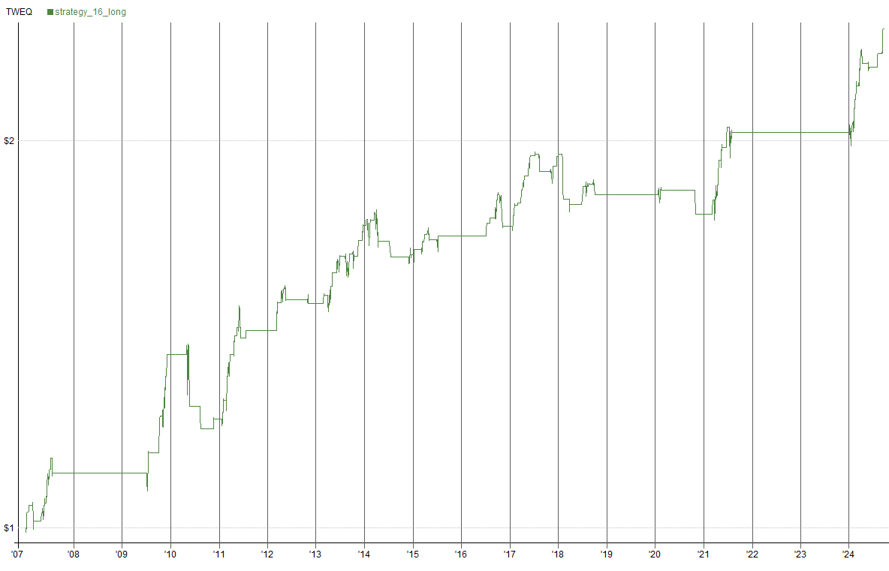
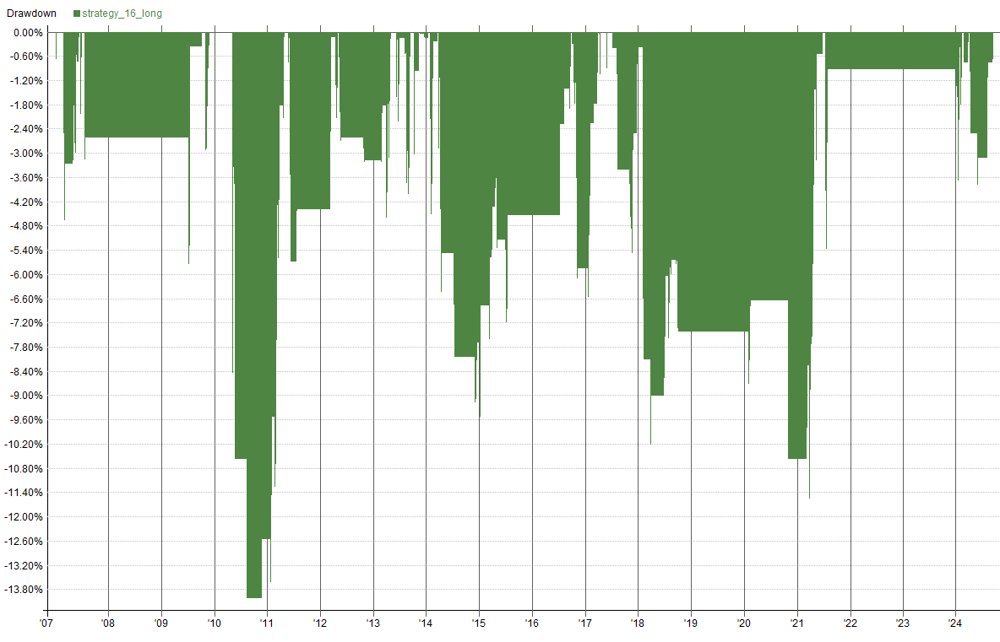
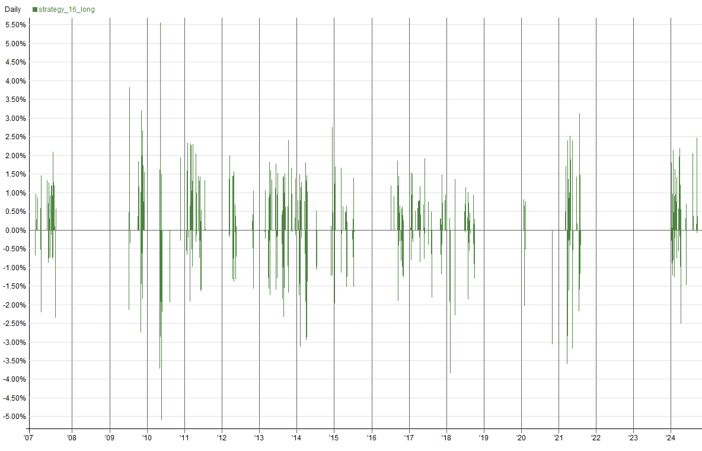
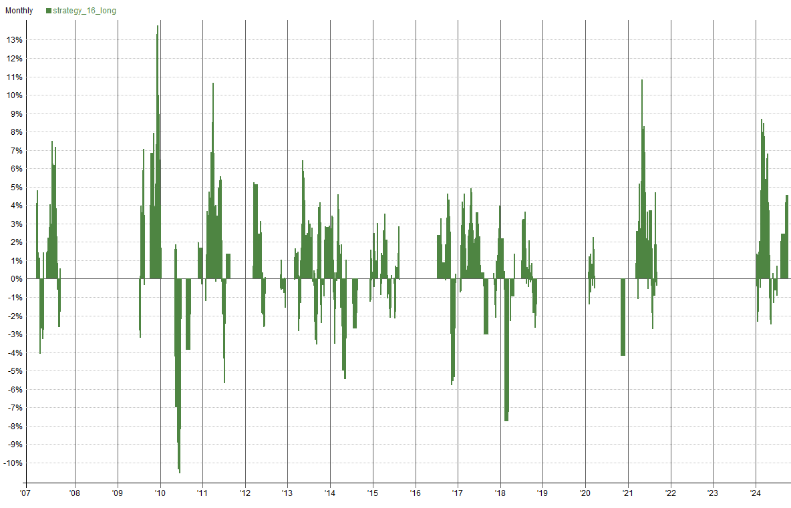
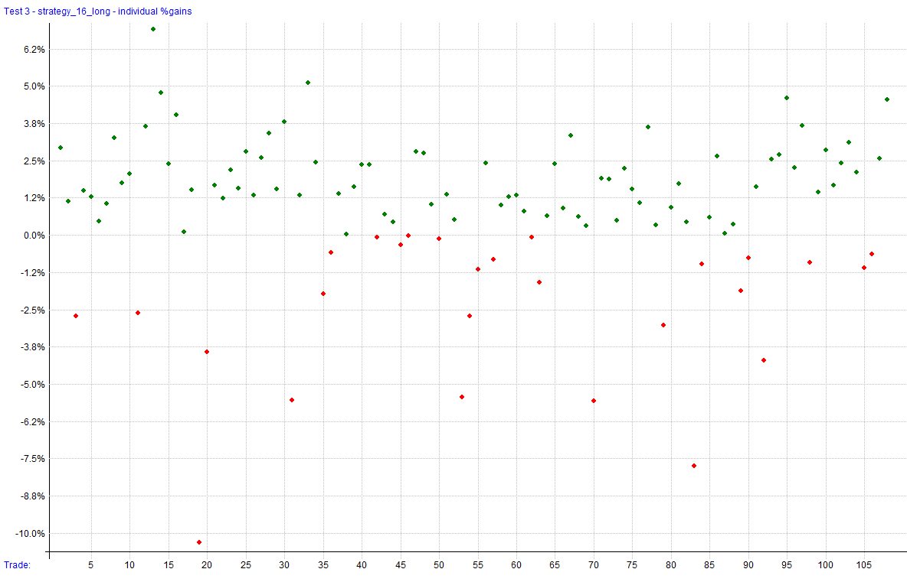
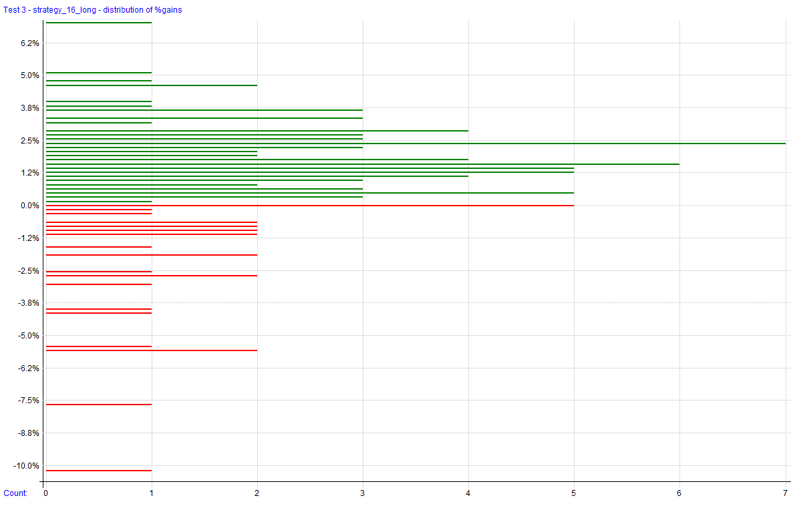
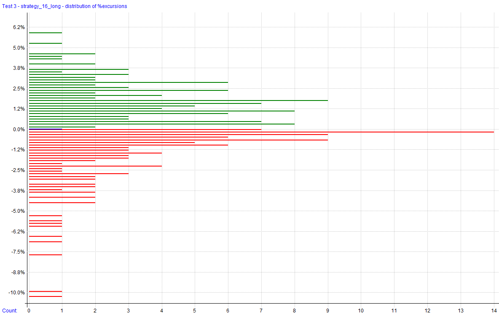
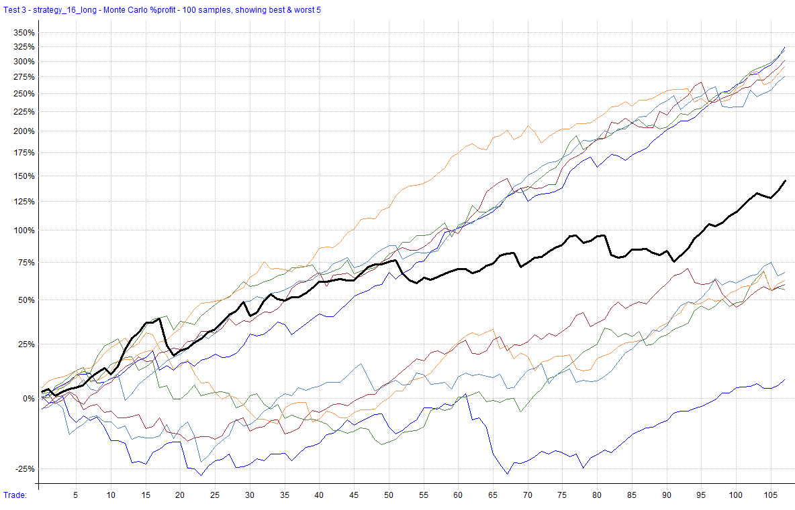
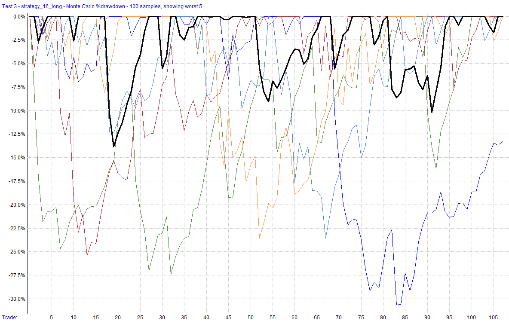

# Strategy 16 

A mean reversion trading strategy that trades IWM and operates exclusively on long positions. It leverages the Close Minus Moving Average (CMMA) indicator to determine optimal times to enter and exit trades based on RTY performance as a breadth/regime filter. 

This file will be updated for as long as the strategy is being developed, deployed (live or simulation), or distributed. Once it has been discontinued, it will be noted here. The code block will always reflect the most recent version of the strategy. The change log can be used to see changes and adjustments to the code over time. 

**Strategy Features**: 

- Day Trading Futures Strategy (Long Only) 
- Trades IWM 
- Utilizes the CMMA to time entries and exits based on R2K performance - Supports long trading strategies
- Commissions and slippage accounted for in backtest results 

**Key Metrics**: _Key metrics are from the latest backtest date in the date range above in the test settings._ 

- Compound Annual Return: **5.21%** 
- Max Historical Drawdown: **-14.01%** 
- Average Holding Period: **4.51 Days** (Win) / **5.22 Days** (Loss) 
- Expectancy Per Trade: **0.87%** 
- Win Rate: **75.00%** 
- Profit Factor: **2.32** 
- Sharpe Ratio: **0.78** 
- MAR Ratio: **0.37** 

## Settings 

| Setting            | Value                    |     |
| ------------------ | ------------------------ | --- |
| Bar Size           | Daily                    |     |
| Account Size Start | $100,000                 |     |
| Data Source        | Norgate                  |     |
| Universe           | IWM                      |     |
| Date Range         | 01/01/2007 to 09/30/2024 |     |
| Platform/Engine    | RealTest                 |     |
| Use Available Bars | False                    |     |

## Summary Stats (Strategy 16) 

|                  | strategy_16_long |     |
| ---------------- | ---------------- | --- |
| **Periods**      | 4,463            |     |
| **NetProfit**    | $144,487         |     |
| **Comp**         | True             |     |
| **ROR**          | 5.21%            |     |
| **MaxDD**        | **-14.01%**      |     |
| **MAR**          | 0.37             |     |
| **Trades**       | 108              |     |
| **PctWins**      | 75.00%           |     |
| **AvgWin**       | 1.98%            |     |
| **AvgLoss**      | 2.47%            |     |
| **WinLen**       | 4.51             |     |
| **LossLen**      | 5.22             |     |
| **Expectancy**   | 0.87%            |     |
| **ProfitFactor** | 2.32             |     |
| **Sharpe**       | 0.78             |     |
| **AvgExp**       | 11.34%           |     |
| **MaxExp**       | 101.66%          |     |

## Combined Monthly Percent Gains

| YEAR | Jan | Feb | Mar | Apr | May | Jun | Jul | Aug | Sep | Oct | Nov | Dec | **TOTAL** | MaxDD | 
| ---- | ------ | ------ | ------ | ------ | ------- | ---- | ----- | ------ | ------ | ------ | ------ | ------ | -------- | ------ | 
| 2007 | 4.1% | 0.6% | -3.3% | 0.0% | 3.3% | 4.7% | 0.8% | 0.0% | 0.0% | 0.0% | 0.0% | 0.0% | **10.4%** | -4.7% | 
| 2008 | 0.0% | 0.0% | 0.0% | 0.0% | 0.0% | 0.0% | 0.0% | 0.0% | 0.0% | 0.0% | 0.0% | 0.0% | **0.0%** | -0.0% | 
| 2009 | 0.0% | 0.0% | 0.0% | 0.0% | 0.0% | 0.0% | 3.6% | 0.0% | 0.0% | 5.0% | 10.1% | 3.2% | **23.6%** | -2.9% | 
| 2010 | 0.0% | 0.0% | 0.0% | 0.0% | -8.9% | 0.0% | 0.0% | -3.9% | 0.0% | 0.0% | 1.7% | 0.0% | **-10.9%** | -14.0% | 
| 2011 | 1.3% | 3.7% | 6.9% | 3.4% | 5.6% | -5.7% | 1.4% | 0.0% | 0.0% | 0.0% | 0.0% | 0.0% | **17.2%** | -5.7% | 
| 2012 | 0.0% | 0.0% | 5.1% | 2.5% | -2.0% | 0.0% | 0.0% | 0.0% | 0.0% | -0.0% | -0.6% | 0.0% | **5.0%** | -3.2% | 
| 2013 | 0.0% | 1.2% | 0.2% | 1.7% | 2.4% | 3.0% | 0.0% | -3.6% | 4.2% | -0.3% | 2.8% | 2.7% | **14.9%** | -4.0% | 
| 2014 | -0.4% | 1.3% | 0.2% | -3.9% | 0.0% | 0.0% | -2.7% | 0.0% | 0.0% | 0.0% | 0.0% | 0.4% | **-5.1%** | -9.2% | 
| 2015 | 1.0% | 0.0% | 2.6% | -0.8% | -0.1% | -0.3% | 0.9% | 0.0% | 0.0% | 0.0% | 0.0% | 0.0% | **3.4%** | -4.2% | 
| 2016 | 0.0% | 0.0% | 0.0% | 0.0% | 0.0% | 0.0% | 2.4% | 0.9% | 4.6% | -3.2% | -2.7% | 0.0% | **1.7%** | -6.1% | 
| 2017 | 2.9% | 0.9% | 2.7% | 2.6% | 1.3% | 2.3% | 0.3% | -3.0% | 0.0% | 0.3% | 0.6% | 1.7% | **13.4%** | -5.5% | 
| 2018 | -0.5% | -7.0% | -1.0% | 0.0% | 0.0% | 0.9% | 1.7% | 1.1% | -0.5% | -1.4% | 0.0% | 0.0% | **-6.7%** | -9.9% | 
| 2019 | 0.0% | 0.0% | 0.0% | 0.0% | 0.0% | 0.0% | 0.0% | 0.0% | 0.0% | 0.0% | 0.0% | 0.0% | **0.0%** | -0.0% | 
| 2020 | -1.4% | 2.3% | 0.0% | 0.0% | 0.0% | 0.0% | 0.0% | 0.0% | 0.0% | -4.2% | 0.0% | 0.0% | **-3.4%** | -4.7% | 
| 2021 | 0.0% | 0.0% | 3.3% | 6.7% | 2.2% | 3.7% | -0.9% | 0.0% | 0.0% | 0.0% | 0.0% | 0.0% | **15.7%** | -5.4% | 
| 2022 | 0.0% | 0.0% | 0.0% | 0.0% | 0.0% | 0.0% | 0.0% | 0.0% | 0.0% | 0.0% | 0.0% | 0.0% | **0.0%** | -0.0% | 
| 2023 | 0.0% | 0.0% | 0.0% | 0.0% | 0.0% | 0.0% | 0.0% | 0.0% | 0.0% | 0.0% | 0.0% | 0.0% | **0.0%** | -0.0% | 
| 2024 | 1.5% | 7.1% | 5.3% | -1.1% | -0.6% | 0.0% | 0.0% | 2.4% | 4.6% | n/a | n/a | n/a | **20.5%** | -3.8% | 
| **AVG** | **0.5%** | **0.6%** | **1.2%** | **0.6%** | **0.2%** | **0.5%** | **0.4%** | **-0.3%** | **0.7%** | **-0.2%** | **0.7%** | **0.5%** | **5.5%** | **-4.6%** | 

## Visualizations 

 

 

 

 
### Trade Plots 

 

 
## Monte Carlo Analysis 

The results for this strategy indicate moderate variability with a range of outcomes. While the backtest shows consistent performance, the Monte Carlo simulations highlight potential vulnerabilities, likely due to the sensitivity of the CMMA and MACD parameters to market conditions. 

| Percentile | Net Profit | CAR | Max Drawdown | 
| ---------- | ---------- | ------ | ------------ | 
| 1% | 56.41% | 2.56% | **-30.29%** | 
| 5% | 73.16% | 3.15% | **-20.06%** | 
| 10% | 86.17% | 3.57% | **-18.56%** | 
| 20% | 106.87% | 4.19% | **-15.40%** | 
| 50% | 157.37% | 5.48% | **-12.01%** | 
| 80% | 215.57% | 6.70% | **-8.61%** | 
| 90% | 238.12% | 7.12% | **-6.56%** | 
| 95% | 292.42% | 8.02% | **-5.57%** | 
| 99% | 363.37% | 9.04% | **-5.44%** | 
| **backtest** | **144.49%** | **5.17%** | **-14.01%** | 

 

