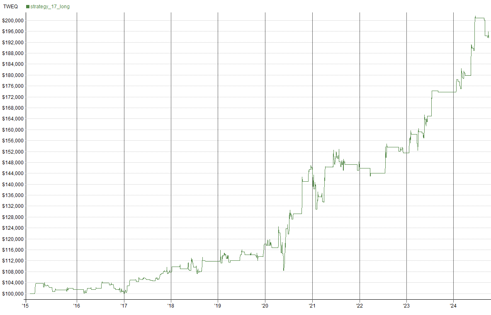
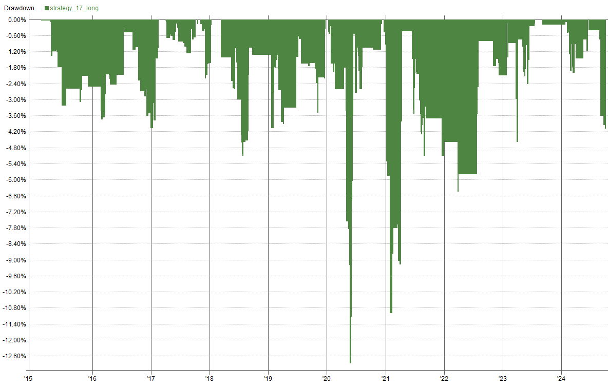
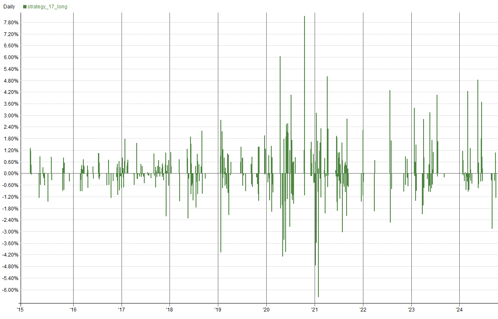
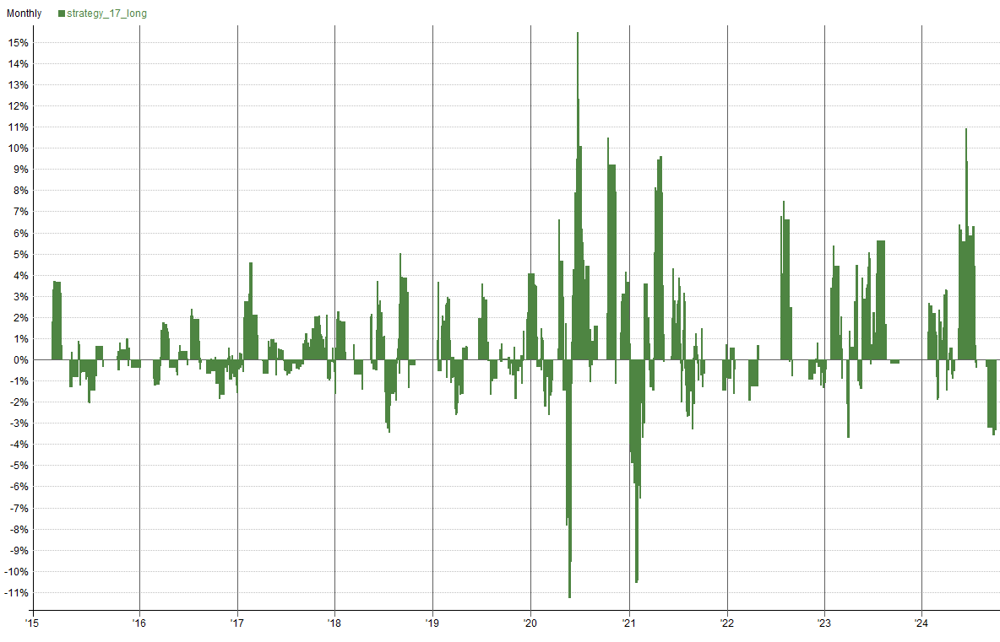
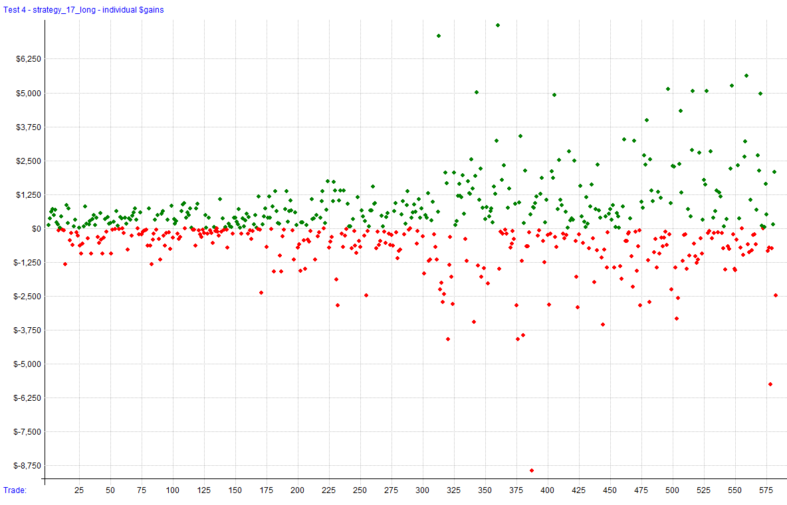
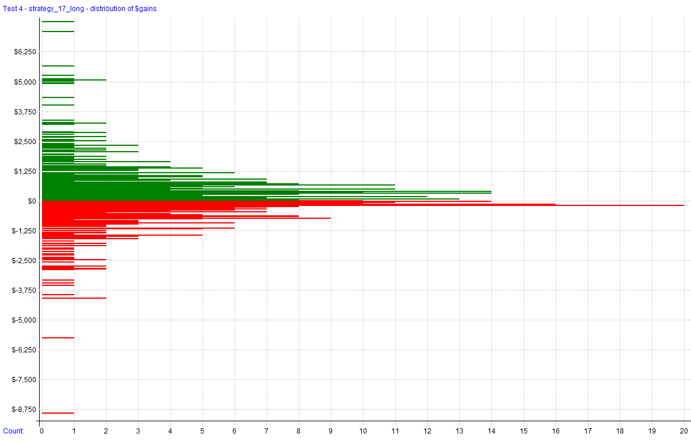
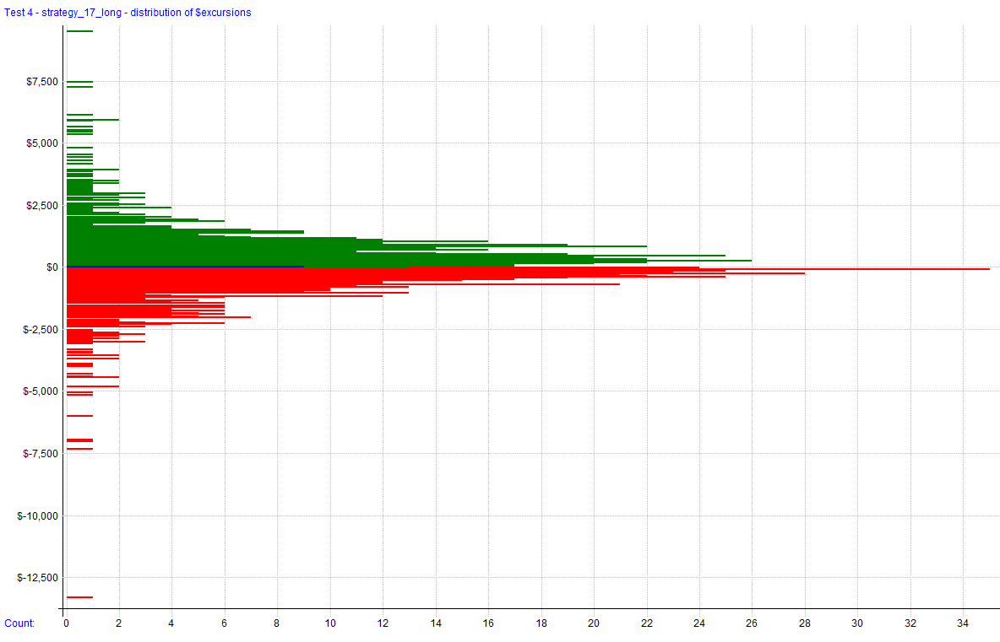
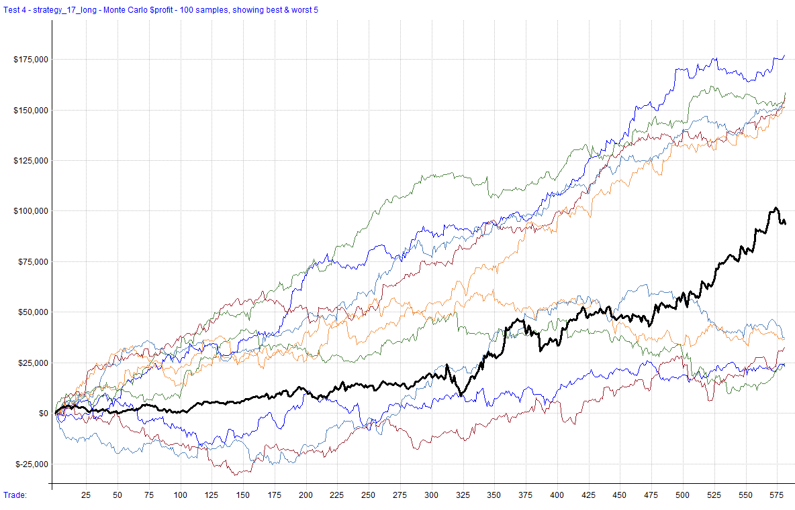
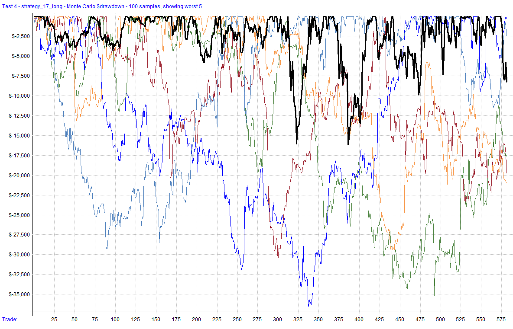

# Strategy 17

An ADX breakout trading strategy for ES and NQ futures contracts operating exclusively on long positions. The strategy utilizes the ADX indicator to identify optimal breakout points for entering trades, aiming to capitalize on trending market conditions.

Source material can be found at:

[“NASDAQ HITTER” ALGO BREAKOUT STRATEGY](https://www.youtube.com/watch?v=eq7alcWRJpA&t=68s)

This document will be updated as the strategy is developed, deployed (live or simulation), or distributed. Once discontinued, it will be noted here. The change log can be used to track adjustments and improvements over time.

**Strategy Features**:

- Trend Following Futures Strategy (Long Only)
- Trades ES and NQ Futures
- Utilizes ADX Indicator for Breakout Signals
- Daily Bar Size for Analysis
- Commissions and Slippage Accounted for in Backtest Results

**Key Metrics**: _Key metrics are from the latest backtest date in the date range above in the test settings._

- Rate of Return (ROR): **9.70%**
- Max Historical Drawdown: **-12.87%**
- Expectancy Per Trade: **0.07%**
- Win Rate: **52.58%**
- Profit Factor: **1.43**
- Sharpe Ratio: **0.79**
- MAR Ratio: **0.75**

## Settings

| Setting                | Value                    |
| ---------------------- | ------------------------ |
| **Bar Size**           | Daily                    |
| **Account Size Start** | $100,000                 |
| **Data Source**        | Norgate                  |
| **Universe**           | ES and NQ Futures        |
| **Date Range**         | 01/02/2015 to 09/30/2024 |
| **Platform/Engine**    | RealTest                 |
| **Use Available Bars** | False                    |

## Summary Stats (Strategy 17)

|                  | strategy_17_long |
| ---------------- | ---------------- |
| **Periods**      | 2,426            |
| **NetProfit**    | $93,466          |
| **Comp**         | False            |
| **ROR**          | 9.70%            |
| **MaxDD**        | **-12.87%**      |
| **MAR**          | 0.75             |
| **Trades**       | 582              |
| **PctWins**      | 52.58%           |
| **AvgWin**       | 0.47%            |
| **AvgLoss**      | 0.38%            |
| **WinLen**       | 0.00             |
| **LossLen**      | 0.00             |
| **Expectancy**   | 0.07%            |
| **ProfitFactor** | 1.43             |
| **Sharpe**       | 0.79             |
| **AvgExp**       | 0.00%            |
| **MaxExp**       | 0.00%            |

## Combined Monthly Percent Gains

| YEAR    | Jan       | Feb      | Mar      | Apr      | May      | Jun      | Jul      | Aug      | Sep       | Oct      | Nov      | Dec      | **TOTAL** | MaxDD     |
| ------- | --------- | -------- | -------- | -------- | -------- | -------- | -------- | -------- | --------- | -------- | -------- | -------- | --------- | --------- |
| 2015    | 0.0%      | 3.7%     | 0.0%     | -0.9%    | -0.6%    | -1.5%    | 0.7%     | 0.0%     | 0.0%      | 0.5%     | 0.0%     | -0.4%    | **1.4%**  | -3.4%     |
| 2016    | 0.0%      | -1.3%    | 1.7%     | -0.4%    | 0.4%     | 0.0%     | 1.9%     | 0.0%     | -0.6%     | -1.7%    | -1.0%    | -0.5%    | **-1.3%** | -4.3%     |
| 2017    | 2.7%      | 2.2%     | -0.0%    | 0.4%     | 0.1%     | -0.4%    | -0.2%    | 0.8%     | -0.1%     | 2.6%     | -1.0%    | 0.6%     | **7.7%**  | -2.4%     |
| 2018    | 1.9%      | 0.0%     | -0.8%    | 0.0%     | -0.6%    | 1.2%     | -1.8%    | 4.2%     | -0.3%     | 0.0%     | 0.0%     | 0.0%     | **3.9%**  | -5.8%     |
| 2019    | 1.8%      | 0.8%     | -2.9%    | 0.6%     | 0.0%     | 2.2%     | -0.1%    | 0.0%     | 0.0%      | -2.2%    | 1.5%     | 4.6%     | **6.4%**  | -4.7%     |
| 2020    | -0.4%     | -1.0%    | 0.0%     | -1.7%    | -4.2%    | 10.9%    | 5.4%     | 2.0%     | 0.0%      | 11.9%    | 1.6%     | 3.4%     | **28.0%** | -16.0%    |
| 2021    | -15.3%    | 4.7%     | -2.0%    | 12.8%    | 0.0%     | 3.3%     | -1.3%    | -0.0%    | -1.0%     | 0.0%     | 0.0%     | -1.3%    | **-0.1%** | -15.3%    |
| 2022    | -0.1%     | 0.0%     | -1.9%    | 0.0%     | 0.0%     | 0.0%     | 10.8%    | -1.3%    | 0.0%      | -1.5%    | 1.2%     | -1.7%    | **5.6%**  | -3.9%     |
| 2023    | 3.6%      | 3.1%     | 0.8%     | 0.1%     | 2.1%     | 3.6%     | 9.3%     | 0.0%     | -0.4%     | 0.0%     | 0.0%     | 0.0%     | **22.3%** | -7.3%     |
| 2024    | 4.4%      | -3.3%    | 5.8%     | -1.0%    | 10.0%    | 11.1%    | 0.0%     | -0.7%    | -6.7%     | n/a      | n/a      | n/a      | **19.6%** | -8.3%     |
| **AVG** | **-0.1%** | **0.9%** | **0.1%** | **1.0%** | **0.7%** | **3.0%** | **2.5%** | **0.5%** | **-0.9%** | **1.1%** | **0.3%** | **0.5%** | **9.3%**  | **-7.1%** |

## Visualizations

   
 

### Trade Plots

   

## Monte Carlo Analysis

The results for this strategy indicate moderate variability with a range of outcomes. 

| Percentile | Net Profit | AAR  | Max Drawdown     |
| ---------- | ---------- | ---- | ----------------- |
| 1%         | $2,074     | $213 | **($47,459)**     |
| 5%         | $26,038    | $2,675 | **($37,312)**  |
| 10%        | $48,258    | $4,958 | **($31,492)**  |
| 20%        | $61,924    | $6,361 | **($25,668)**  |
| 50%        | $93,466    | $9,602 | **($17,640)**  |
| 80%        | $121,198   | $12,451 | **($12,004)** |
| 90%        | $135,128   | $13,882 | **($10,514)** |
| 95%        | $147,276   | $15,130 | **($9,991)**  |
| 99%        | $164,816   | $16,932 | **($9,338)**  |
| **Backtest** | **$93,466** | **$9,602** | **($16,164)** |

 
