# Strategy 20

A mean reversion strategy for ES/NQ and SPY that uses a simple SPX regime filter and the close minus moving average (CMMA) indicator to time entries. This strategies works on multiple instruments.2050

This document will be updated as the strategy is developed, deployed (live or simulation), or distributed. Once discontinued, it will be noted here. The change log can be used to track adjustments and improvements over time.

## Strategy 20 ES/NQ

**Strategy Features**:

- Trend and Reversal Strategy (Long and Short)
- Trades ES/NQ Contracts
- Utilizes Money Flow & MACD for Entry Signals
- Daily Bar Size
- Commissions & Slippage Included in Backtest

**Key Metrics**  
_From latest backtest covering 1/2/2015 – 12/13/2024_

- **Rate of Return (ROR)**: **11.53%**
- **Max Historical Drawdown**: **-17.35%**
- **Expectancy Per Trade**: **0.48%**
- **Win Rate**: **76.86%**
- **Profit Factor**: **3.27**
- **Sharpe Ratio**: **1.03**
- **MAR Ratio**: **0.66**

---

### Settings

| Setting                | Value                     |
| ---------------------- | ------------------------- |
| **Bar Size**           | Daily                     |
| **Account Size Start** | \$100,000                 |
| **Data Source**        | Norgate                   |
| **Universe**           | ES/NQ                     |
| **Date Range**         | 01/02/2015 to 12/13/2024  |
| **Platform/Engine**    | RealTest                  |
| **Use Available Bars** | False                     |

---

### Summary Stats (Strategy 20 ES/NQ)

|                  | strategy_20_long | strategy_20_short | Combined     |
| ---------------- | ---------------- | ----------------- | ------------ |
| **Periods**      | 2,462           | 2,314             | 2,462        |
| **NetProfit**    | \$68,710        | \$43,923          | \$112,633    |
| **Comp**         | False           | False             | False        |
| **ROR**          | 7.04%           | 4.78%             | **11.53%**   |
| **MaxDD**        | **-7.07%**      | **-13.10%**       | **-17.35%**  |
| **MAR**          | 0.99            | 0.36              | 0.66         |
| **Trades**       | 75              | 46                | 121          |
| **PctWins**      | 78.67%          | 73.91%            | **76.86%**   |
| **AvgWin**       | 0.72%           | 1.20%             | 0.90%        |
| **AvgLoss**      | 0.51%           | 1.46%             | 0.92%        |
| **Expectancy**   | 0.46%           | 0.50%             | **0.48%**    |
| **ProfitFactor** | 5.56            | 2.28              | **3.27**     |
| **Sharpe**       | 1.05            | 0.55              | **1.03**     |
| **AvgExp**       | 6.25%           | 0.00%             | 8.06%        |
| **MaxExp**       | 406.79%         | 0.00%             | 690.98%      |

---

### Combined Monthly Percent Gains (Strategy 20 ES/NQ)

| YEAR | Jan    | Feb    | Mar      | Apr    | May      | Jun    | Jul    | Aug    | Sep    | Oct      | Nov    | Dec      | **TOTAL** | MaxDD    |
| ---- | ------ | ------ | -------- | ------ | -------- | ------ | ------ | ------ | ------ | -------- | ------ | -------- | --------- | -------- |
| 2015 | 0.0%   | 0.0%   | 1.0%     | 1.3%   | 3.8%     | 1.0%   | 0.0%   | 0.0%   | 0.0%   | **-1.3%**| 0.0%   | 0.0%     | **5.7%**  | -1.5%    |
| 2016 | 0.0%   | 2.5%   | 0.0%     | 0.0%   | 0.0%     | 0.6%   | 0.0%   | 0.0%   | 4.1%   | **-0.8%**| 0.0%   | 0.0%     | **6.4%**  | -1.4%    |
| 2017 | 0.0%   | 0.0%   | 0.7%     | 0.0%   | 1.5%     | 1.2%   | 0.7%   | 0.4%   | 0.0%   | 0.0%     | 0.0%   | 0.0%     | **4.4%**  | -0.0%    |
| 2018 | 0.0%   | 0.0%   | 0.0%     | 0.0%   | 0.0%     | 2.7%   | 1.9%   | 0.0%   | 0.0%   | **-2.5%**| 0.0%   | 4.8%     | **6.9%**  | -2.9%    |
| 2019 | 0.0%   | 0.0%   | 0.0%     | 0.0%   | **-2.7%**| 0.0%   | 0.0%   | 0.0%   | 0.0%   | 3.5%     | 0.0%   | 0.0%     | **0.7%**  | -5.8%    |
| 2020 | 5.4%   | 0.0%   | 8.9%     | 17.3%  | 0.0%     | 0.0%   | 0.0%   | 0.0%   | 6.4%   | 0.1%     | 0.8%   | 0.0%     | **38.9%** | -7.6%    |
| 2021 | 3.8%   | 3.6%   | 0.0%     | 0.0%   | 5.4%     | 3.8%   | 2.8%   | 0.7%   | 0.4%   | 5.4%     | 10.8%  | 0.0%     | **36.7%** | -1.7%    |
| 2022 | 0.0%   | 0.3%   | **-13.0%**| 0.0%  | 2.8%     | 17.0%  | 2.7%   | 0.0%   | 0.0%   | 0.0%     | 2.0%   | **-5.0%**| **6.8%**  | -17.3%   |
| 2023 | 0.0%   | 1.7%   | 0.0%     | 2.0%   | 0.0%     | 0.0%   | 0.0%   | 0.0%   | 1.0%   | 0.0%     | 0.0%   | 0.0%     | **4.7%**  | -1.9%    |
| 2024 | 0.0%   | 0.0%   | 0.0%     | 0.0%   | 0.0%     | 0.0%   | 0.0%   | 0.0%   | 0.0%   | 0.0%     | 1.3%   | 0.0%     | **1.3%**  | -1.1%    |
| **AVG** | **0.9%** | **0.8%** | **-0.3%** | **2.1%** | **1.1%** | **2.6%** | **0.8%** | **0.1%** | **1.2%** | **0.4%** | **1.5%** | **-0.0%** | **11.3%** | **-4.2%** |

---

### Strategy Correlations

#### Returns

| RETURNS              | strategy_20_long | strategy_20_short | Combined |
| -------------------- | --------------- | ----------------- | -------- |
| **strategy_20_long** | 1.00            | -0.00             | 0.61     |
| **strategy_20_short**| -0.00           | 1.00              | 0.78     |
| **Combined**         | 0.61            | 0.78              | 1.00     |

#### Drawdowns

| DRAWDOWNS            | strategy_20_long | strategy_20_short | Combined |
| -------------------- | --------------- | ----------------- | -------- |
| **strategy_20_long** | 1.00            | -0.10             | 0.33     |
| **strategy_20_short**| -0.10           | 1.00              | 0.84     |
| **Combined**         | 0.33            | 0.84              | 1.00     |

---

### Visualizations

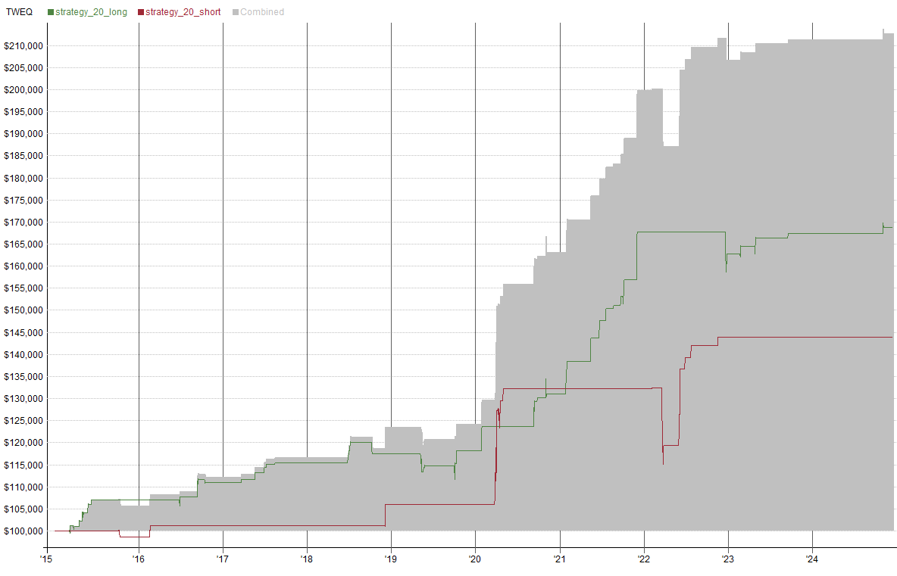 
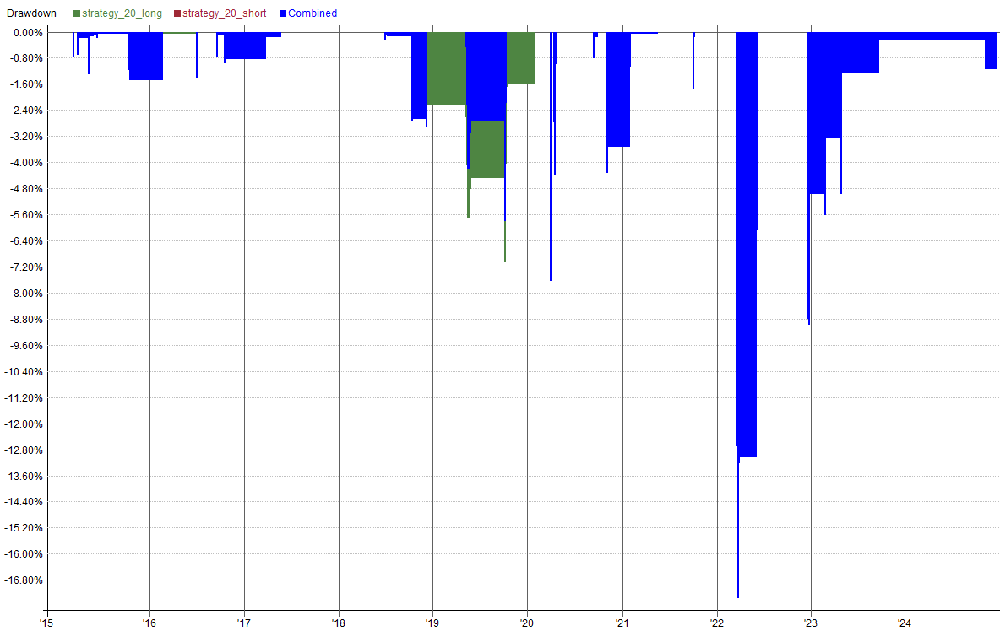  
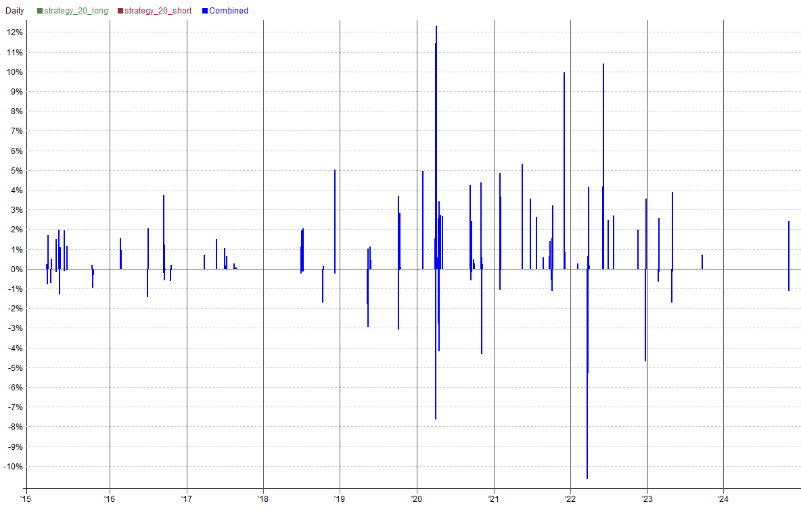 
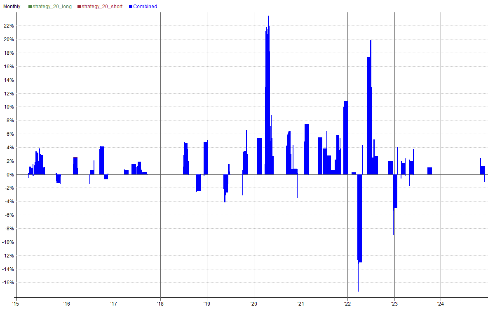

#### Trade Plots

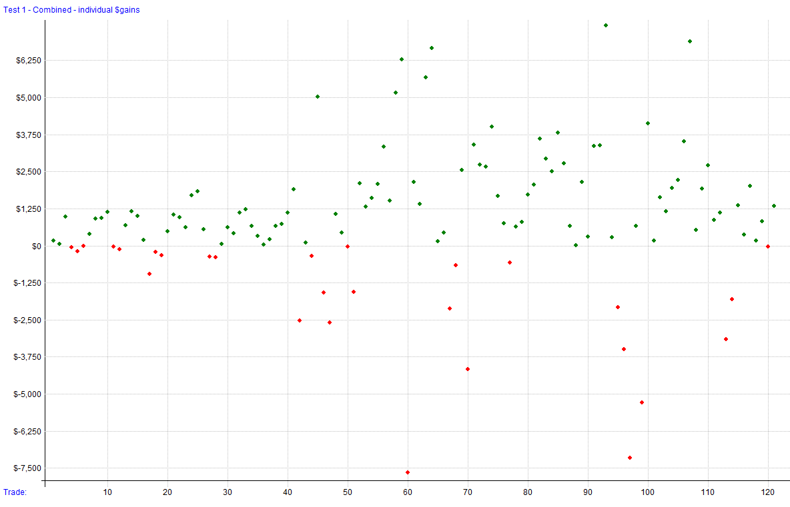 
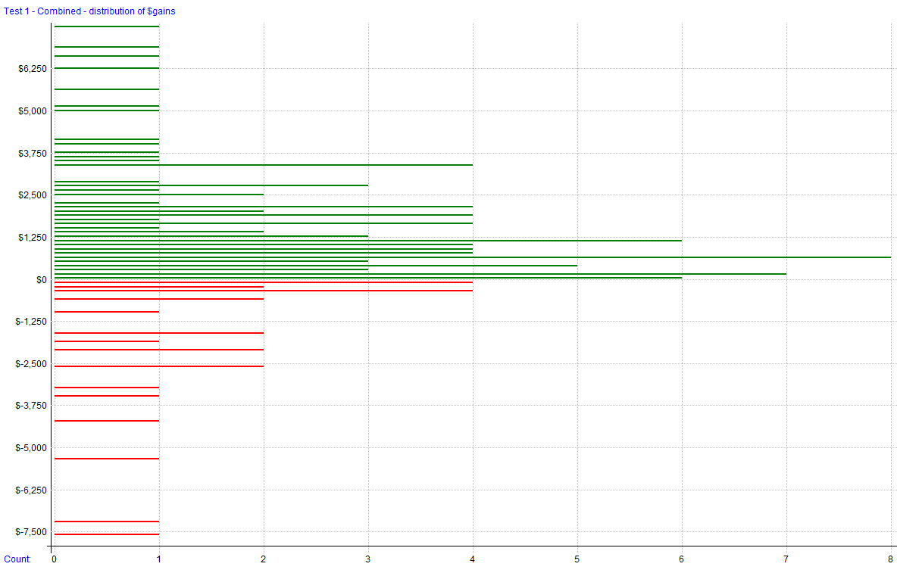
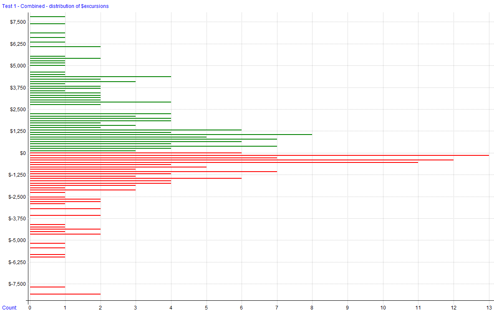

---

*Generated by RealTest. These results are subject to change based on parameter adjustments or further development.*  
### Monte Carlo Analysis (Strategy 20 ES/NQ)

| Percentile | Net Profit | AAR       | Max Drawdown     |
| ---------- | --------- | --------- | ---------------- |
| 1%         | \$40,750   | \$4,098   | **(\$22,788)**   |
| 5%         | \$79,568   | \$8,001   | **(\$21,088)**   |
| 10%        | \$86,743   | \$8,723   | **(\$16,114)**   |
| 20%        | \$97,353   | \$9,790   | **(\$13,678)**   |
| 50%        | \$114,083  | \$11,472  | **(\$10,538)**   |
| 80%        | \$132,078  | \$13,282  | **(\$7,640)**    |
| 90%        | \$146,556  | \$14,737  | **(\$7,504)**    |
| 95%        | \$152,143  | \$15,299  | **(\$6,456)**    |
| 99%        | \$170,043  | \$17,099  | **(\$4,177)**    |
| **backtest** | **\$112,633** | **\$11,326** | **(\$17,348)** |

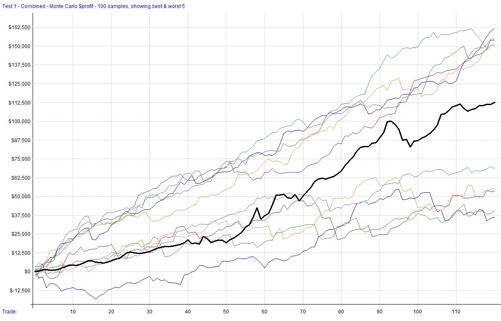 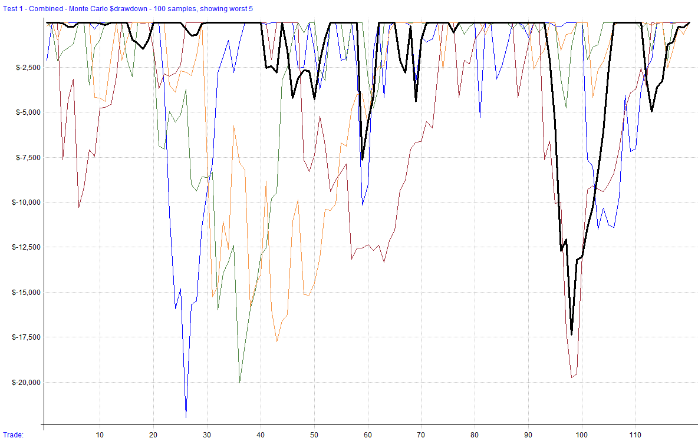

## Strategy 20 SPY

**Strategy Features**:

- Trend and Reversal Strategy (Long Only)
- Trades SPY Contracts
- Utilizes Money Flow & MACD for Entry Signals
- Daily Bar Size
- Commissions & Slippage Included in Backtest

**Key Metrics**  
_From latest backtest covering 1/2/2015 – 12/13/2024_

- **Rate of Return (ROR)**: **7.70%**
- **Max Historical Drawdown**: **-13.99%**
- **Expectancy Per Trade**: **4.76%**
- **Win Rate**: **64.71%**
- **Profit Factor**: **6.58**
- **Sharpe Ratio**: **0.84**
- **MAR Ratio**: **0.55**

---

### Settings

| Setting                | Value                     |
| ---------------------- | ------------------------- |
| **Bar Size**           | Daily                     |
| **Account Size Start** | \$100,000                 |
| **Data Source**        | Norgate                   |
| **Universe**           | SPY                       |
| **Date Range**         | 01/02/2015 to 12/13/2024  |
| **Platform/Engine**    | RealTest                  |
| **Use Available Bars** | False                     |

---

### Summary Stats (Strategy 20 SPY)

|                  | strategy_20SPY_long |
| ---------------- | ------------------- |
| **Periods**      | 2,503               |
| **NetProfit**    | \$106,616           |
| **Comp**         | True                |
| **ROR**          | 7.70%               |
| **MaxDD**        | **-13.99%**         |
| **MAR**          | 0.55                |
| **AvgMar**       | 1.62                |
| **MAE**          | **-9.01%**          |
| **MFE**          | 28.81%              |
| **Trades**       | 17                  |
| **PctWins**      | **64.71%**          |
| **AvgWin**       | 8.46%               |
| **AvgLoss**      | 2.04%               |
| **WinLen**       | 86.45               |
| **LossLen**      | 35.83               |
| **Expectancy**   | **4.76%**           |
| **TradeLen**     | 68.59               |
| **AvgWinAmt**    | \$11,428.63         |
| **AvgLossAmt**   | \$3,183.23          |
| **ExpectAmt**    | \$6,271.50          |
| **ProfitFactor** | **6.58**            |
| **Sharpe**       | **0.84**            |
| **Volatility**   | 9.21%               |
| **Skew**         | **-0.66899**        |
| **Sortino**      | 1.24                |
| **Skipped**      | 62.22%              |
| **AvgExp**       | 46.72%              |
| **MaxExp**       | 101.21%             |
| **AvgUse**       | 46.72%              |
| **MaxUse**       | 105.36%             |

---

### Combined Monthly Percent Gains (Strategy 20 SPY)

| YEAR | Jan    | Feb    | Mar    | Apr    | May   | Jun    | Jul   | Aug    | Sep   | Oct      | Nov    | Dec    | **TOTAL** | MaxDD    |
| ---- | ------ | ------ | ------ | ------ | ----- | ------ | ----- | ------ | ----- | -------- | ------ | ------ | --------- | -------- |
| 2015 | 1.7%   | 5.6%   | **-1.6%** | 1.0%   | 1.3%  | **-2.0%** | 2.2%  | **-6.4%** | 0.0%  | 0.0%     | 0.0%   | 0.0%   | **1.4%**  | -11.8%   |
| 2016 | 0.0%   | 0.0%   | 0.0%   | 0.0%   | 0.0%  | 3.9%   | 3.6%  | 0.1%   | 0.0%  | **-1.7%** | 0.1%   | 0.0%   | **6.0%**  | -4.3%    |
| 2017 | 0.0%   | 0.0%   | 0.8%   | 1.0%   | 1.4%  | 0.6%   | 2.0%  | 0.3%   | 2.0%  | 2.3%     | 2.3%   | 0.0%   | **13.5%** | -2.1%    |
| 2018 | 0.0%   | **-0.6%** | 2.0%   | 0.1%   | 0.0%  | **-0.1%** | 3.7%  | 3.2%   | 0.6%  | **-3.5%** | 0.0%   | 0.0%   | **5.2%**  | -6.8%    |
| 2019 | 0.0%   | 0.0%   | 0.0%   | 0.0%   | **-4.3%** | 2.6%   | 0.0%  | 2.3%   | 2.0%  | 2.2%     | 3.6%   | 2.9%   | **11.6%** | -4.7%    |
| 2020 | **-0.0%** | **-7.9%** | 4.5%   | 0.0%   | 0.0%  | 0.0%   | 0.0%  | 0.0%   | **-0.4%** | **-2.5%** | 11.0% | 3.7%   | **7.5%**  | -12.4%   |
| 2021 | **-1.0%** | 2.8%   | 4.5%   | 5.3%   | 0.7%  | 2.2%   | 2.4%  | 3.0%   | **-4.6%** | 7.0%     | **-0.8%** | 7.4%   | **32.1%** | -5.1%    |
| 2022 | **-7.0%** | **-3.2%** | 0.0%   | 0.0%   | 0.0%  | 0.0%   | 0.0%  | 0.0%   | 0.0%  | 0.0%     | 0.0%   | 0.0%   | **-10.0%** | -12.6%   |
| 2023 | 0.0%   | 0.0%   | 0.0%   | 0.0%   | 0.0%  | 0.0%   | 0.0%  | 0.0%   | 0.0%  | 0.0%     | 0.0%   | 0.0%   | **0.0%**  | -0.0%    |
| 2024 | 0.0%   | 0.0%   | 0.0%   | **-2.6%** | 5.1%  | 3.6%   | 1.2%  | **-3.8%** | 5.7%  | **-0.9%** | 4.3%   | 0.0%   | **12.8%** | -8.4%    |
| **AVG** | **-0.6%** | **-0.3%** | **1.0%** | **0.5%** | **0.4%** | **1.1%** | **1.5%** | **-0.1%** | **0.5%** | **0.3%** | **2.0%** | **1.4%** | **8.0%** | **-6.8%** |

---

### Visualizations

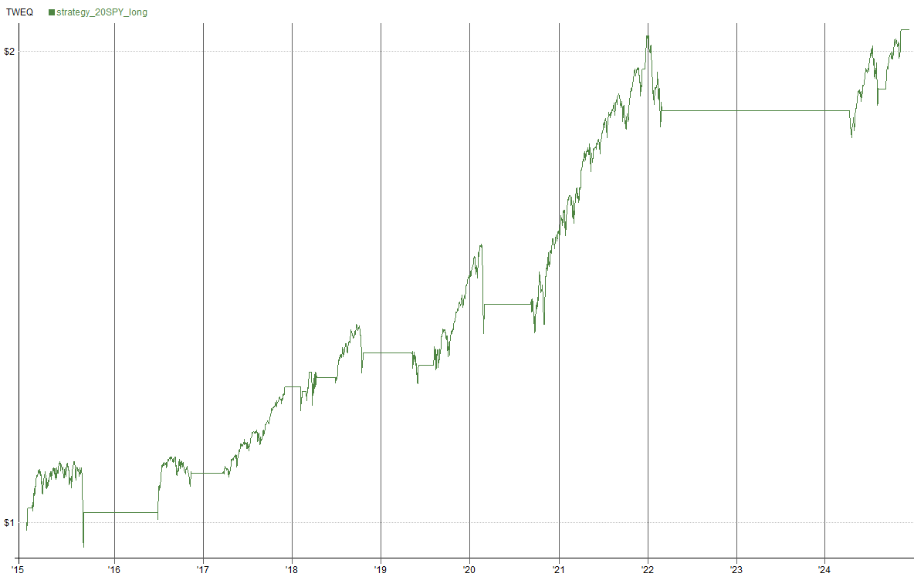  
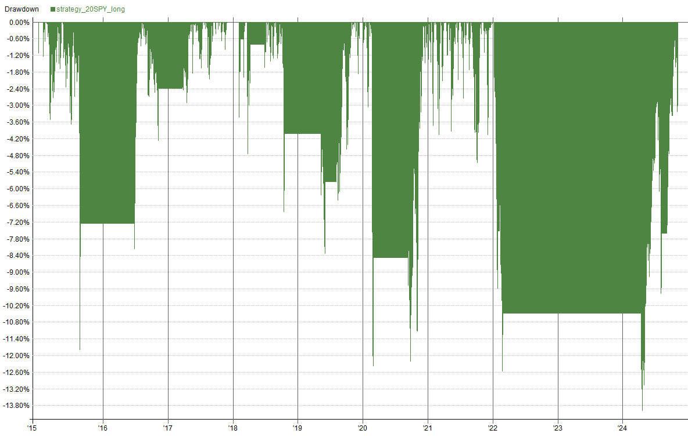  
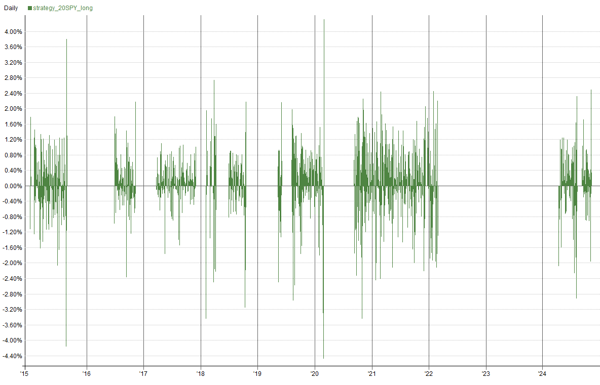  
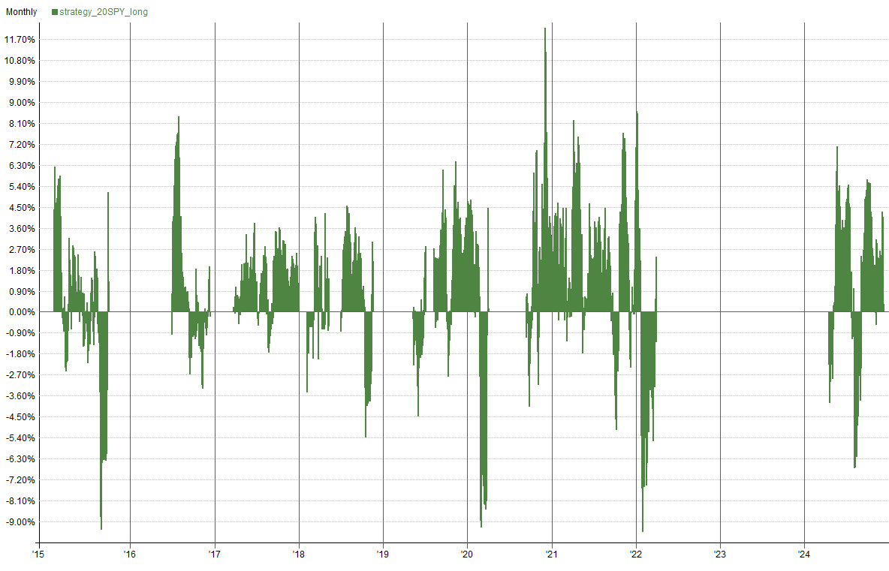

#### Trade Plots

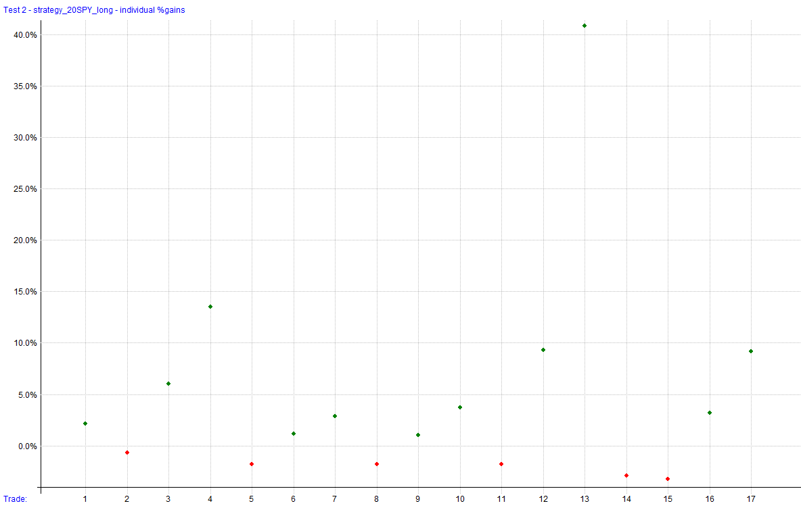  
  
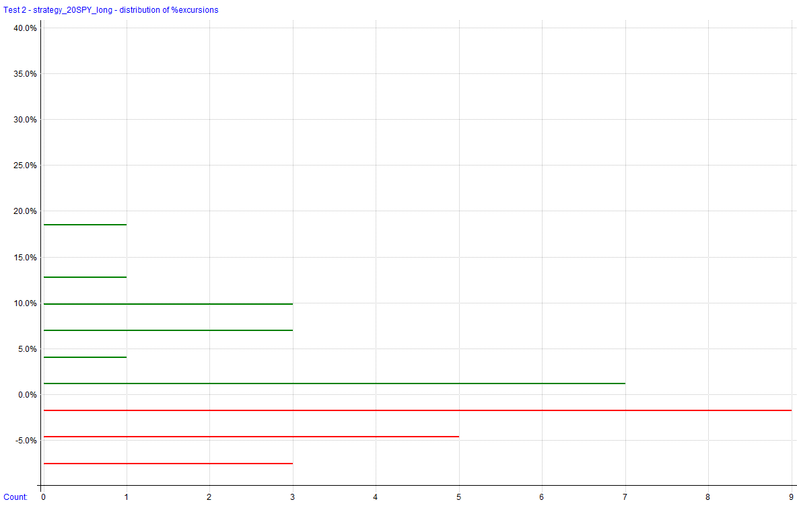

---

*Generated by RealTest. These results are subject to change based on parameter adjustments or further development.*  

### Monte Carlo Analysis (Strategy 20 SPY)

| Percentile | Net Profit | CAR      | Max Drawdown  |
| ---------- | ---------- | -------- | ------------- |
| 1%         | 0.98%      | 0.10%    | **-11.86%**   |
| 5%         | 23.58%     | 2.15%    | **-10.86%**   |
| 10%        | 35.13%     | 3.08%    | **-9.03%**    |
| 20%        | 49.13%     | 4.10%    | **-7.68%**    |
| 50%        | 91.29%     | 6.74%    | **-4.96%**    |
| 80%        | 152.07%    | 9.75%    | **-3.20%**    |
| 90%        | 200.45%    | 11.70%   | **-2.50%**    |
| 95%        | 254.82%    | 13.59%   | **-1.81%**    |
| 99%        | 435.26%    | 18.38%   | **-0.70%**    |
| **backtest** | **106.62%** | **7.57%** | **-13.99%** |

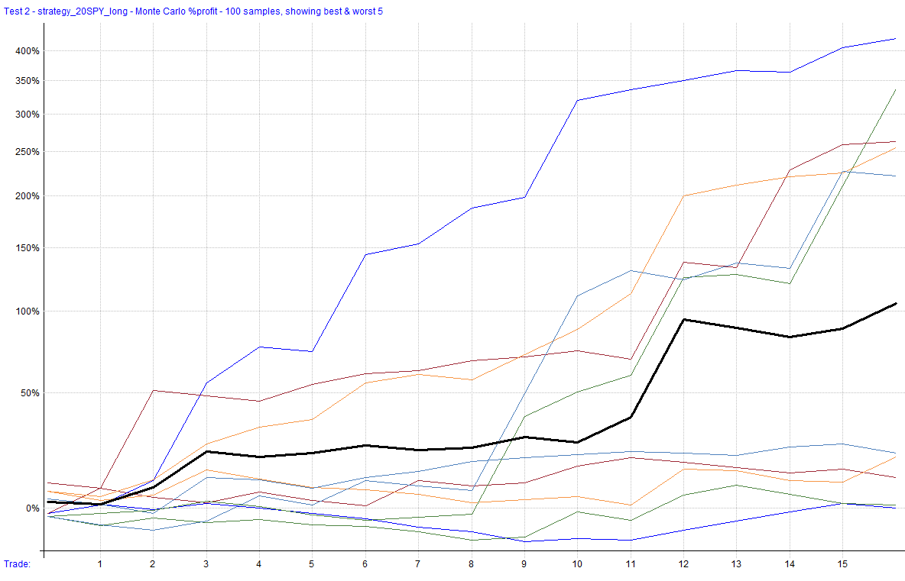  
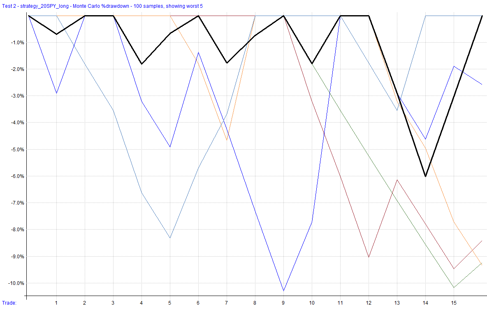