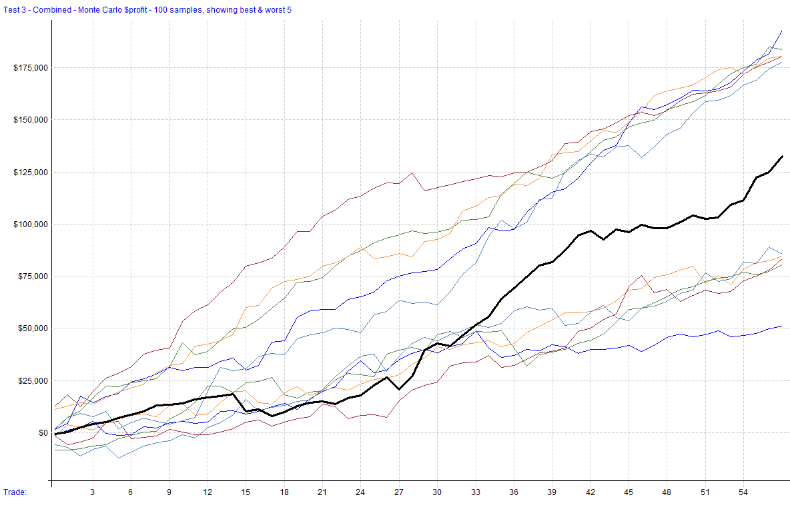

# 25_ES

A trend-following strategy for the ES/MES that leverages VIX-based indicators and moving averages alongside ATR-based risk management to identify and capitalize on market trends. The strategy takes long and short positions. It operates on daily bars and incorporates risk controls to manage drawdowns and optimize returns.

This document will be updated as the strategy is developed, deployed (live or simulation), or distributed. Once discontinued, it will be noted here. The change log can be used to track adjustments and improvements over time.

## Strategy 25_ES

**Strategy Features**:

- VIX-Based Trend-Following
- Trades ES/MES
- Utilizes ATR for Risk Management
- Daily Bar Size
- Commissions & Slippage Included in Backtest

**Key Metrics**  
_From latest backtest covering 1/2/2015 – 12/27/2024_

- **Rate of Return (ROR)**: **13.28%**
- **Max Historical Drawdown**: **-14.53%**
- **Expectancy Per Trade**: **1.18%**
- **Win Rate**: **81.03%**
- **Profit Factor**: **5.59**
- **Sharpe Ratio**: **1.08**
- **MAR Ratio**: **0.91**

### Settings

| Setting                | Value                      |
| :--------------------- | :------------------------- |
| **Bar Size**           | Daily                      |
| **Account Size Start** | $100,000                   |
| **Data Source**        | RealTest Data File         |
| **Universe**           | ESNQ                       |
| **Date Range**         | 01/02/2015 to 12/27/2024   |
| **Platform/Engine**    | RealTest                   |
| **Use Available Bars** | False                      |

### Summary Stats (Strategy 25_ES)

|                  | strategy_25_long | strategy_25_short |   Combined |
| :--------------- | ---------------: | -----------------: | ---------: |
| **Periods**      |            2,514 |             1,734 |      2,514 |
| **NetProfit**    |       $101,810    |           $30,711   |   $132,522 |
| **Comp**         |             False |              False |      False |
| **ROR**          |           10.20%  |             4.46%  |  **13.28%** |
| **MaxDD**        |          -15.37%  |            -1.24%  | **-14.53%** |
| **MAR**          |             0.66   |              3.60   |   **0.91** |
| **Trades**       |               51  |                 7   |         58 |
| **PctWins**      |           80.39%  |            85.71%  | **81.03%** |
| **AvgWin**       |            1.56%  |             3.40%  |      1.79% |
| **AvgLoss**      |            1.48%  |             0.87%  |      1.43% |
| **Expectancy**   |            0.96%  |             2.79%  |  **1.18%** |
| **TradeLen**     |             4.94   |              0.00   |      4.34 |
| **ProfitFactor** |             4.69  |             25.78   |   **5.59** |
| **Sharpe**       |             0.89  |              0.73   |   **1.08** |
| **Volatility**   |           11.41%  |             6.08%   |      12.35% |
| **Skew**         |          0.24632  |          26.11176   |    2.27045 |
| **Sortino**      |             1.40   |              9.45   |   **1.84** |
| **Skipped**      |           53.64%  |             0.00%   |     50.43% |
| **AvgExp**       |           19.72%  |             0.00%   |     19.72% |
| **MaxExp**       |          304.90%  |             0.00%   |    304.90% |
| **AvgUse**       |           19.72%  |             0.63%   |     20.16% |
| **MaxUse**       |          301.80%  |           174.07%   |    347.56% |

### Combined Monthly Percent Gains (Strategy 25_ES)

| YEAR | Jan    | Feb    | Mar    | Apr    | May    | Jun    | Jul    | Aug    | Sep    | Oct    | Nov    | Dec    | **TOTAL** | MaxDD    |
| ---- | ------ | ------ | ------ | ------ | ------ | ------ | ------ | ------ | ------ | ------ | ------ | ------ | --------- | -------- |
| 2015 | -0.0%  | 2.6%   | 2.0%   | 0.4%   | 0.0%   | -0.0%  | 3.7%   | 0.0%   | 0.0%   | 0.0%   | 1.5%   | 0.0%   | **10.2%** | -2.6%    |
| 2016 | 0.0%   | 0.0%   | 0.0%   | 0.0%   | 0.0%   | 3.1%   | -0.2%  | 0.0%   | 0.4%   | 0.0%   | 0.0%   | 0.0%   | **3.3%**  | -0.8%    |
| 2017 | 0.0%   | 0.0%   | 0.7%   | 0.0%   | 1.6%   | 0.0%   | 0.0%   | 1.8%   | 0.0%   | 0.0%   | 0.0%   | 0.0%   | **4.1%**  | -0.6%    |
| 2018 | -0.0%  | -7.5%  | -3.0%  | 2.7%   | 0.0%   | 0.8%   | 2.0%   | 0.0%   | 0.0%   | 1.8%   | 0.0%   | 0.0%   | **-3.1%** | -13.9%   |
| 2019 | 0.0%   | 0.0%   | 0.0%   | 0.0%   | 0.5%   | 0.0%   | 0.0%   | 1.7%   | 0.0%   | 1.1%   | 0.0%   | 0.0%   | **3.3%**  | -6.4%    |
| 2020 | -0.8%  | -8.0%  | 37.8%  | 0.0%   | 0.0%   | 5.1%   | 0.0%   | 0.0%   | 3.8%   | -0.7%  | 9.1%   | 0.0%   | **46.4%** | -13.6%   |
| 2021 | 0.0%   | 0.0%   | 0.0%   | 0.0%   | 5.2%   | 0.0%   | 5.4%   | 0.0%   | 2.3%   | 4.6%   | 0.0%   | 12.8%  | **30.4%** | -4.0%    |
| 2022 | -1.3%  | 3.0%   | -0.0%  | 3.5%   | 0.0%   | 0.0%   | 0.0%   | 0.0%   | 0.0%   | 0.0%   | 0.0%   | 0.0%   | **5.2%**  | -13.0%   |
| 2023 | 0.0%   | 0.0%   | 0.0%   | 0.0%   | 0.0%   | 0.0%   | 0.0%   | -1.5%  | -2.3%  | 2.1%   | 0.0%   | 0.0%   | **-1.6%** | -8.7%    |
| 2024 | 2.9%   | 0.0%   | 0.0%   | 1.6%   | 0.0%   | 0.0%   | -0.3%  | 6.9%   | 2.2%   | 0.0%   | 13.4%  | 7.7%   | **34.4%** | -8.5%    |
| **AVG** | **0.1%** | **-1.0%** | **3.7%** | **0.8%** | **0.7%** | **0.9%** | **1.1%** | **0.9%** | **0.7%** | **0.9%** | **2.4%** | **2.1%** | **13.3%** | **-7.2%** |

### Strategy Correlations

#### Returns

| RETURNS           | strategy_25_long | strategy_25_short | Combined |
| ----------------- | -----------------: | -----------------: | -------:|
| **strategy_25_long** | 1.00              | -0.03              | 0.91    |
| **strategy_25_short** | -0.03             | 1.00               | 0.38    |
| **Combined**       | 0.91              | 0.38               | 1.00    |

#### Drawdowns

| DRAWDOWNS         | strategy_25_long | strategy_25_short | Combined |
| ----------------- | -----------------: | -----------------: | -------:|
| **strategy_25_long** | 1.00              | 0.04              | 0.93    |
| **strategy_25_short** | 0.04              | 1.00               | 0.00    |
| **Combined**       | 0.93              | 0.00               | 1.00    |

### Visualizations

  
  
  

#### Trade Plots

  
  

### Monte Carlo Analysis (Strategy 25_ES)

| Percentile | Net Profit | AAR        | Max Drawdown  |
| :--------- | :--------- | :--------- | :------------ |
| 1%         | $80,534    | $8,069     | **($19,020)**   |
| 5%         | $89,846    | $9,003     | **($15,874)**    |
| 10%        | $97,522    | $9,772     | **($14,146)**    |
| 20%        | $108,634   | $10,885    | **($12,214)**    |
| 50%        | $132,522   | $13,278    | **($14,533)**    |
| 80%        | $155,446   | $15,576    | **($5,744)**    |
| 90%        | $167,684   | $16,802    | **($5,714)**    |
| 95%        | $180,459   | $18,082    | **($4,252)**    |
| 99%        | $195,296   | $19,568    | **($3,040)**    |
| **backtest** | **$132,522** | **$13,278** | **($14,533)** |

  

---
*Generated by RealTest. These results are subject to change based on parameter adjustments or further development.*
