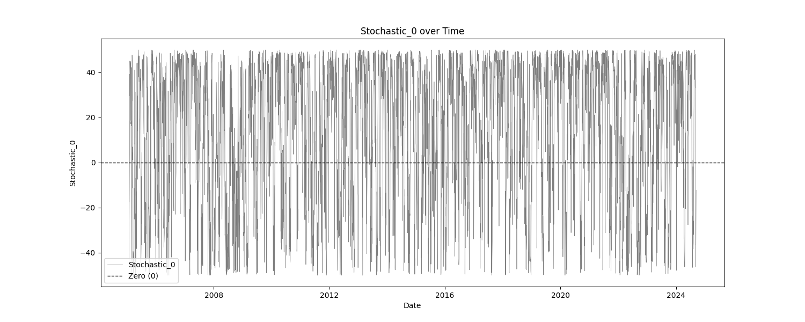
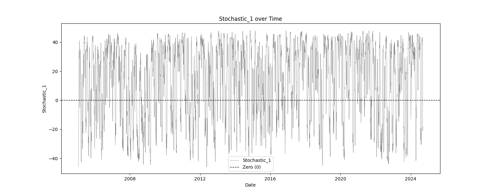
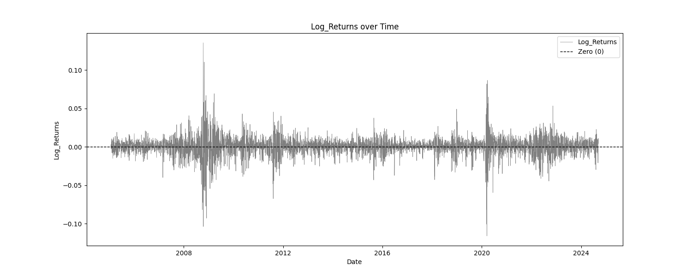

# Indicator Soundness Report Stochastic
The generated report provides a comprehensive analysis of trading indicators, offering insights into their statistical properties, predictive power, mean stability over time, and optimal thresholds for profitability. It combines detailed statistical summaries, mutual information scores, mean break tests, and profit factor evaluations.

## Simple Statistics and Relative Entropy Report

The Simple Statistics Table summarizes key metrics for each trading indicator, including the number of cases, mean, minimum, maximum, interquartile range (IQR), range/IQR ratio, and relative entropy. In the table, a lower range/IQR ratio suggests a tighter, more predictable dataset, while an optimal relative entropy indicates a balance of diversity and uniqueness without excessive noise.

**Ncases**: Number of cases (bars) in feature (indicator).
**Mean**: Average value of the feature across all cases.
**Min/Max**: The minimum and maximum value of the feature across all cases.
**IQR**: Interquartile Range, measures range minus the top and bottom 25% of the raw range.
**Range/IQR**: A unitless measure of data dispersion relative to its middle 50%.
**Relative Entropy**: Measures the difference between two probability distributions; a value of zero indicates identical distributions.

| Indicator           | Ncases | Mean           | Min            | Max            | IQR            | rnq/IQR        | Relative Entropy    |
|---------------------|--------|----------------|----------------|----------------|----------------|----------------|---------------------|
| Stochastic_0        | 4941   | 13.7506        | -50.0000       | 50.0000        | 52.7310        | 1.8964         | 0.9321              |
| Stochastic_1        | 4941   | 13.7394        | -45.8011       | 48.2130        | 43.9095        | 2.1411         | 0.9438              |
| Stochastic_2        | 4941   | 13.7247        | -45.6835       | 47.0952        | 39.1684        | 2.3687         | 0.9362              |
## Mutual Information Report

High MI scores indicate a strong relationship between the indicator and the target variable, suggesting potential predictive power. Low p-values further validate the indicator's statistical significance.

**MI Score**: Measures the mutual dependence between the feature and the target.
**Solo p-value**: Initial significance estimate, proportion of permuted MI scores equal to or higher than the original MI scores.
**Unbiased p-value**: Adjusted solo p-value considering the number of permutations plus one, reducing bias.

| Indicator           | Target              | MI Score            | Solo p-value        | Unbiased p-value    |
|---------------------|---------------------|---------------------|---------------------|---------------------|
| Stochastic_0       | Log_Returns        | 0.1407              | 0.0000              | 0.0010              |
| Stochastic_1       | Log_Returns        | 0.0541              | 0.0000              | 0.0010              |
| Stochastic_2       | Log_Returns        | 0.0448              | 0.0000              | 0.0010              |

## Serial Correlated Mean Break Test Report

The Serial Correlated Mean Break Test Report identifies potential breaks in the mean of each trading indicator, taking into account serial correlation. This test helps detect significant shifts in the mean over time, indicating nonstationary behavior in the data.

**nrecent**: The number of recent observations considered in the test.
**z(U)**: The greatest break encountered in the mean across the user-specified range.
**Solo p-value**: Measures the significance of the greatest break while accounting for the entire range of boundaries searched. If this value is not small, it suggests that the indicator does not have a significant mean break.
**Unbiased p-value**: Adjusted p-value considering multiple indicators.

| Indicator           | n_recent | z(U)     | Solo p-value | Unbiased p-value |
|---------------------|----------|----------|--------------|-----------------|
| Stochastic_0        | 2500.0   | 27.9273  | 0.9110       | 0.4450          |
| Stochastic_1        | 2500.0   | 27.9827  | 0.1660       | 0.4450          |
| Stochastic_2        | 2500.0   | 27.9858  | 0.1600       | 0.4450          |

## Optimal Thresholds w/ Profit Factor Report

The Optimal Thresholds w/ Profit Factor Report evaluates various threshold levels for trading indicators to identify the most profitable long and short positions. The report includes the fraction of data points greater than or equal to the threshold, the corresponding profit factor for long and short positions, and the fraction of data points less than the threshold with their respective profit factors. The optimal thresholds at the bottom indicate the threshold levels with the highest profit factors for long and short positions, while the p-values provide statistical significance for these thresholds.

### Stochastic_0 vs Log_Returns

| Threshold | Frac Gtr/Eq | Long PF    | Short PF   | Frac Less | Short PF   | Long PF    |
|-----------|-------------|------------|------------|-----------|------------|------------|
|  -49.018 |      0.990 |       1.0960 |       0.9124 |         0.010 |       0.5364 |       1.8643 |
|  -43.815 |      0.950 |       1.0801 |       0.9259 |         0.050 |       0.6952 |       1.4383 |
|  -35.088 |      0.900 |       1.0602 |       0.9432 |         0.100 |       0.7175 |       1.3937 |
|  -19.364 |      0.800 |       1.0529 |       0.9497 |         0.200 |       0.8059 |       1.2409 |
|   -2.825 |      0.700 |       1.0441 |       0.9577 |         0.300 |       0.8387 |       1.1923 |
|   10.447 |      0.600 |       1.0943 |       0.9138 |         0.400 |       0.8966 |       1.1153 |
|   22.644 |      0.500 |       1.0881 |       0.9190 |         0.500 |       0.8967 |       1.1152 |
|   32.248 |      0.400 |       1.0231 |       0.9774 |         0.600 |       0.8807 |       1.1354 |
|   38.644 |      0.300 |       1.0068 |       0.9933 |         0.700 |       0.8866 |       1.1279 |
|   43.410 |      0.200 |       1.0029 |       0.9971 |         0.800 |       0.8935 |       1.1191 |
|   47.094 |      0.100 |       1.0022 |       0.9978 |         0.900 |       0.8994 |       1.1119 |
|   48.635 |      0.050 |       0.9661 |       1.0351 |         0.950 |       0.9013 |       1.1095 |
|   49.858 |      0.010 |       0.9749 |       1.0258 |         0.990 |       0.9038 |       1.1064 |

**Grand profit factor**: 1.106
**Optimal long threshold**: -36.2155, profit factor = 1.493
**Optimal short threshold**: 48.4365, profit factor = 1.192

**P-values**: Long=0.999, Unbiased Long=0.999
**P-values**: Short=0.001, Unbiased Short=0.002

### Stochastic_1 vs Log_Returns

| Threshold | Frac Gtr/Eq | Long PF    | Short PF   | Frac Less | Short PF   | Long PF    |
|-----------|-------------|------------|------------|-----------|------------|------------|
|  -40.206 |      0.990 |       1.0950 |       0.9133 |         0.010 |       0.5968 |       1.6755 |
|  -32.288 |      0.950 |       1.0851 |       0.9216 |         0.050 |       0.7608 |       1.3144 |
|  -25.655 |      0.900 |       1.0566 |       0.9464 |         0.100 |       0.7305 |       1.3689 |
|  -13.547 |      0.800 |       1.0806 |       0.9254 |         0.200 |       0.8617 |       1.1605 |
|   -1.437 |      0.700 |       1.1120 |       0.8992 |         0.300 |       0.9107 |       1.0980 |
|   10.479 |      0.600 |       1.0996 |       0.9094 |         0.400 |       0.9003 |       1.1107 |
|   20.539 |      0.500 |       1.0587 |       0.9446 |         0.500 |       0.8836 |       1.1317 |
|   28.495 |      0.400 |       1.0865 |       0.9204 |         0.600 |       0.8989 |       1.1125 |
|   33.851 |      0.300 |       1.0374 |       0.9640 |         0.700 |       0.8916 |       1.1215 |
|   38.341 |      0.200 |       0.9921 |       1.0080 |         0.800 |       0.8918 |       1.1213 |
|   42.180 |      0.100 |       1.1992 |       0.8339 |         0.900 |       0.9082 |       1.1010 |
|   44.288 |      0.050 |       0.9493 |       1.0534 |         0.950 |       0.9008 |       1.1101 |
|   46.406 |      0.010 |       1.2268 |       0.8151 |         0.990 |       0.9047 |       1.1053 |

**Grand profit factor**: 1.106
**Optimal long threshold**: -30.4538, profit factor = 1.435
**Optimal short threshold**: 44.2872, profit factor = 1.069

**P-values**: Long=0.999, Unbiased Long=0.999
**P-values**: Short=0.001, Unbiased Short=0.002

### Stochastic_2 vs Log_Returns

| Threshold | Frac Gtr/Eq | Long PF    | Short PF   | Frac Less | Short PF   | Long PF    |
|-----------|-------------|------------|------------|-----------|------------|------------|
|  -37.010 |      0.990 |       1.0847 |       0.9219 |         0.010 |       0.3462 |       2.8885 |
|  -28.510 |      0.950 |       1.0986 |       0.9102 |         0.050 |       0.8505 |       1.1758 |
|  -21.713 |      0.900 |       1.0682 |       0.9361 |         0.100 |       0.7753 |       1.2897 |
|  -10.727 |      0.800 |       1.0688 |       0.9357 |         0.200 |       0.8412 |       1.1888 |
|    0.368 |      0.700 |       1.0926 |       0.9153 |         0.300 |       0.8907 |       1.1228 |
|   10.545 |      0.600 |       1.1036 |       0.9061 |         0.400 |       0.9030 |       1.1075 |
|   19.081 |      0.500 |       1.1260 |       0.8881 |         0.500 |       0.9133 |       1.0950 |
|   26.088 |      0.400 |       1.0922 |       0.9156 |         0.600 |       0.9003 |       1.1108 |
|   31.771 |      0.300 |       1.0373 |       0.9640 |         0.700 |       0.8907 |       1.1227 |
|   36.194 |      0.200 |       1.0462 |       0.9558 |         0.800 |       0.8976 |       1.1140 |
|   40.514 |      0.100 |       1.0720 |       0.9329 |         0.900 |       0.9027 |       1.1077 |
|   42.562 |      0.050 |       1.1468 |       0.8720 |         0.950 |       0.9053 |       1.1046 |
|   45.241 |      0.010 |       0.8492 |       1.1775 |         0.990 |       0.9030 |       1.1074 |

**Grand profit factor**: 1.106
**Optimal long threshold**: -21.9492, profit factor = 1.302
**Optimal short threshold**: 39.7797, profit factor = 1.055

**P-values**: Long=0.999, Unbiased Long=0.999
**P-values**: Short=0.000, Unbiased Short=0.001
