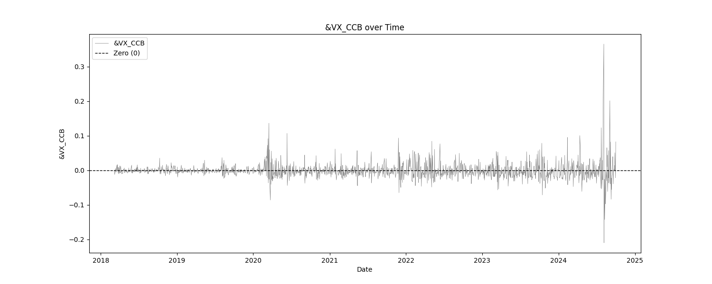
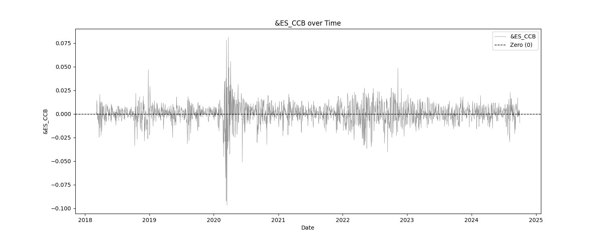
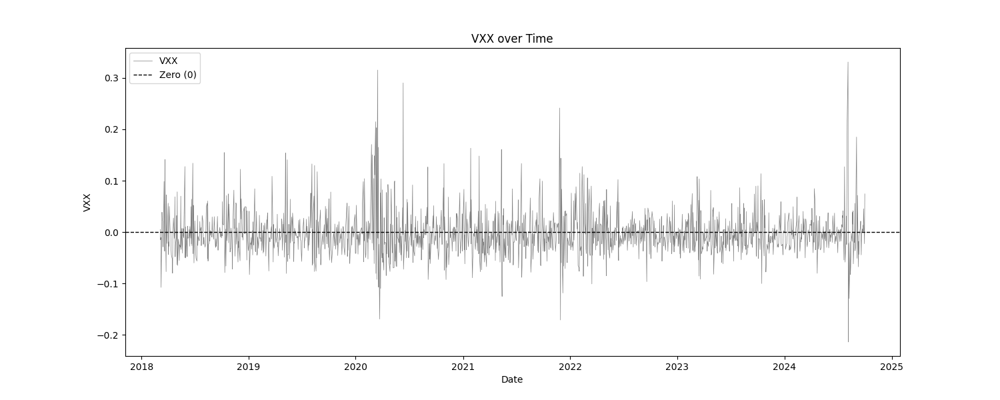
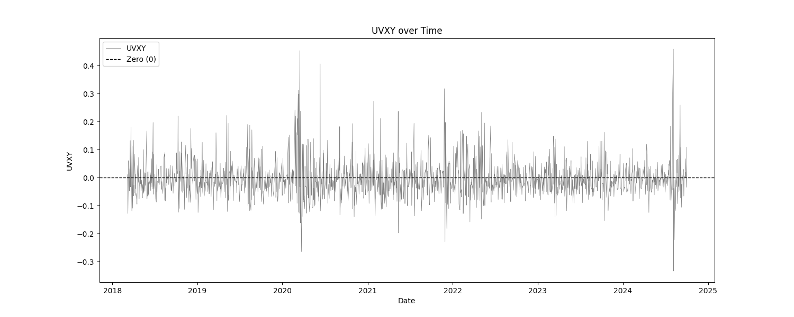
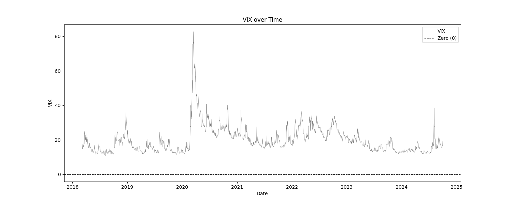

# Indicator Soundness Report VIX_Related_Products
The generated report provides a comprehensive analysis of trading indicators, offering insights into their statistical properties, predictive power, mean stability over time, and optimal thresholds for profitability. It combines detailed statistical summaries, mutual information scores, mean break tests, and profit factor evaluations.

At least, that is what this report usually does. In this particular report, the only "indicator" is the VIX. Everything else are the log returns of SPY and VIX products. The tests that we are most concerned with are the basic statistics, the mean break test, and the eyeball test (look at the charts). We are checking to make sure that the products that we intend to trade are, themselves, stationary. This report does show that, for the most part. The VIX indicator has not been normalized at all, in order to asses it in it's raw form.

Interestingly enough though, the mutual information test and the optimization tables show us if there any predictive power in the returns against the returns of SPY. The results are interesting.

Data sourced from Norgate Data.















## Simple Statistics and Relative Entropy Report

The Simple Statistics Table summarizes key metrics for each trading indicator, including the number of cases, mean, minimum, maximum, interquartile range (IQR), range/IQR ratio, and relative entropy. In the table, a lower range/IQR ratio suggests a tighter, more predictable dataset, while an optimal relative entropy indicates a balance of diversity and uniqueness without excessive noise.

**Ncases**: Number of cases (bars) in feature (indicator).
**Mean**: Average value of the feature across all cases.
**Min/Max**: The minimum and maximum value of the feature across all cases.
**IQR**: Interquartile Range, measures range minus the top and bottom 25% of the raw range.
**Range/IQR**: A unitless measure of data dispersion relative to its middle 50%.
**Relative Entropy**: Measures the difference between two probability distributions; a value of zero indicates identical distributions.

| Indicator           | Ncases | Mean           | Min            | Max            | IQR            | rnq/IQR        | Relative Entropy    |
|---------------------|--------|----------------|----------------|----------------|----------------|----------------|---------------------|
| &VX_CCB             | 1679   | -0.0011        | -0.2097        | 0.3656         | 0.0150         | 38.2873        | 0.2016              |
| SPY                 | 1679   | 0.0005         | -0.1159        | 0.0867         | 0.0114         | 17.7881        | 0.4153              |
| &ES_CCB             | 1679   | 0.0004         | -0.0968        | 0.0812         | 0.0107         | 16.6545        | 0.4015              |
| VXX                 | 1679   | -0.0021        | -0.2137        | 0.3308         | 0.0425         | 12.8167        | 0.5141              |
| UVXY                | 1679   | -0.0041        | -0.4072        | 0.5081         | 0.0664         | 13.7932        | 0.4799              |
| SVXY                | 1679   | -0.0010        | -1.7695        | 0.1254         | 0.0222         | 85.2501        | 0.0503              |
| VIX                 | 1679   | 20.0516        | 10.8500        | 82.6900        | 8.5150         | 8.4369         | 0.5266              |
## Mutual Information Report

High MI scores indicate a strong relationship between the indicator and the target variable, suggesting potential predictive power. Low p-values further validate the indicator's statistical significance.

**MI Score**: Measures the mutual dependence between the feature and the target.
**Solo p-value**: Initial significance estimate, proportion of permuted MI scores equal to or higher than the original MI scores.
**Unbiased p-value**: Adjusted solo p-value considering the number of permutations plus one, reducing bias.

| Indicator           | Target              | MI Score            | Solo p-value        | Unbiased p-value    |
|---------------------|---------------------|---------------------|---------------------|---------------------|
| &VX_CCB            | SPY_Log_Returns    | 0.1499              | 0.0000              | 0.0010              |
| SPY                | SPY_Log_Returns    | 0.8617              | 0.0000              | 0.0010              |
| &ES_CCB            | SPY_Log_Returns    | 0.6345              | 0.0000              | 0.0010              |
| VXX                | SPY_Log_Returns    | 0.3108              | 0.0000              | 0.0010              |
| UVXY               | SPY_Log_Returns    | 0.3457              | 0.0000              | 0.0010              |
| SVXY               | SPY_Log_Returns    | 0.0635              | 0.0000              | 0.0010              |
| VIX                | SPY_Log_Returns    | 0.1538              | 0.0000              | 0.0010              |

## Serial Correlated Mean Break Test Report

The Serial Correlated Mean Break Test Report identifies potential breaks in the mean of each trading indicator, taking into account serial correlation. This test helps detect significant shifts in the mean over time, indicating nonstationary behavior in the data.

**nrecent**: The number of recent observations considered in the test.
**z(U)**: The greatest break encountered in the mean across the user-specified range.
**Solo p-value**: Measures the significance of the greatest break while accounting for the entire range of boundaries searched. If this value is not small, it suggests that the indicator does not have a significant mean break.
**Unbiased p-value**: Adjusted p-value considering multiple indicators.

| Indicator           | n_recent | z(U)     | Solo p-value | Unbiased p-value |
|---------------------|----------|----------|--------------|-----------------|
| &VX_CCB             | 2500.0   | 29.6941  | 0.1400       | 0.1810          |
| SPY                 | 2500.0   | 29.6940  | 0.7730       | 0.1810          |
| &ES_CCB             | 2500.0   | 29.6940  | 0.9120       | 0.1810          |
| VXX                 | 2500.0   | 29.6941  | 0.3980       | 0.1810          |
| UVXY                | 2500.0   | 29.6943  | 0.1330       | 0.1810          |
| SVXY                | 2500.0   | 29.6940  | 0.7180       | 0.1810          |
| VIX                 | 2500.0   | 28.9626  | 0.9990       | 0.1810          |

## Optimal Thresholds w/ Profit Factor Report

The Optimal Thresholds w/ Profit Factor Report evaluates various threshold levels for trading indicators to identify the most profitable long and short positions. The report includes the fraction of data points greater than or equal to the threshold, the corresponding profit factor for long and short positions, and the fraction of data points less than the threshold with their respective profit factors. The optimal thresholds at the bottom indicate the threshold levels with the highest profit factors for long and short positions, while the p-values provide statistical significance for these thresholds.

### &VX_CCB vs SPY_Log_Returns

| Threshold | Frac Gtr/Eq | Long PF    | Short PF   | Frac Less | Short PF   | Long PF    |
|-----------|-------------|------------|------------|-----------|------------|------------|
|   -0.052 |      0.990 |       1.1131 |       0.8984 |         0.010 |       0.4615 |       2.1670 |
|   -0.028 |      0.951 |       1.1334 |       0.8823 |         0.049 |       1.0159 |       0.9844 |
|   -0.021 |      0.901 |       1.1703 |       0.8545 |         0.099 |       1.1765 |       0.8500 |
|   -0.013 |      0.800 |       1.1517 |       0.8683 |         0.200 |       0.9676 |       1.0334 |
|   -0.008 |      0.700 |       1.1386 |       0.8782 |         0.300 |       0.9160 |       1.0916 |
|   -0.005 |      0.600 |       1.1016 |       0.9078 |         0.400 |       0.8651 |       1.1559 |
|   -0.003 |      0.500 |       1.1117 |       0.8995 |         0.500 |       0.8801 |       1.1362 |
|    0.000 |      0.401 |       1.1123 |       0.8990 |         0.599 |       0.8835 |       1.1319 |
|    0.003 |      0.300 |       1.1787 |       0.8484 |         0.700 |       0.9128 |       1.0955 |
|    0.008 |      0.200 |       1.1557 |       0.8653 |         0.800 |       0.8991 |       1.1122 |
|    0.018 |      0.100 |       1.0904 |       0.9171 |         0.900 |       0.8856 |       1.1291 |
|    0.032 |      0.050 |       1.0074 |       0.9927 |         0.950 |       0.8817 |       1.1341 |
|    0.073 |      0.010 |       3.4763 |       0.2877 |         0.990 |       0.9131 |       1.0952 |

**Grand profit factor**: 1.123
**Optimal long threshold**: 0.0035, profit factor = 1.215
**Optimal short threshold**: -0.0254, profit factor = 1.306

**P-values**: Long=0.999, Unbiased Long=0.999
**P-values**: Short=0.000, Unbiased Short=0.001

### SPY vs SPY_Log_Returns

This is very interesting. This optimization table takes a feature, in this case it is SPY returns, and then determines profit factor by looking at the returns of the target (still SPY) the next day. In other words, it measures where the most predictability in a feature is. In this case, however, we are comparing SPY returns to SPY returns the next day. Think about that. That means that if this is right, you can use the returns on a product itself to help accurately predict price movement the following day. 

An example test of this could look something like this:

```python
log_returns = (np.log(Close / Close[1])) * 100 # for readabillity
entry_short = log_returns[1] > 1.68
```

In plain words, enter long when the previous days log returns is greater than 1.68.

| Threshold | Frac Gtr/Eq | Long PF    | Short PF   | Frac Less | Short PF   | Long PF    |
|-----------|-------------|------------|------------|-----------|------------|------------|
|   -0.035 |      0.990 |       1.1073 |       0.9031 |         0.010 |       0.5479 |       1.8250 |
|   -0.019 |      0.951 |       1.0733 |       0.9317 |         0.049 |       0.5815 |       1.7196 |
|   -0.013 |      0.901 |       1.1143 |       0.8974 |         0.099 |       0.8545 |       1.1703 |
|   -0.007 |      0.800 |       1.1088 |       0.9019 |         0.200 |       0.8616 |       1.1607 |
|   -0.003 |      0.700 |       1.0742 |       0.9309 |         0.300 |       0.8306 |       1.2040 |
|   -0.001 |      0.600 |       1.0845 |       0.9221 |         0.400 |       0.8568 |       1.1672 |
|    0.001 |      0.500 |       1.1001 |       0.9090 |         0.500 |       0.8755 |       1.1423 |
|    0.003 |      0.400 |       1.0705 |       0.9342 |         0.600 |       0.8655 |       1.1554 |
|    0.005 |      0.300 |       0.9872 |       1.0129 |         0.700 |       0.8439 |       1.1850 |
|    0.009 |      0.200 |       0.8370 |       1.1947 |         0.800 |       0.8202 |       1.2192 |
|    0.013 |      0.100 |       0.6346 |       1.5758 |         0.900 |       0.8160 |       1.2255 |
|    0.017 |      0.050 |       0.4589 |       2.1792 |         0.950 |       0.8266 |       1.2097 |
|    0.030 |      0.010 |       0.1635 |       6.1152 |         0.990 |       0.8501 |       1.1763 |

**Grand profit factor**: 1.123
**Optimal long threshold**: -0.0189, profit factor = 1.720
**Optimal short threshold**: 0.0168, profit factor = 2.205

**P-values**: Long=0.999, Unbiased Long=0.999
**P-values**: Short=0.000, Unbiased Short=0.001

### &ES_CCB vs SPY_Log_Returns

This is just cool. Using the the returns of the SPY futures contract (ES) to predict the returns of SPY the next day. Much like the Spy v. Spy comparison, this one shows long profitability on SPY when the returns of ES are largely negative and vice versa for shorts. Those are not nominal profit factors either, if they are to be trusted.

| Threshold | Frac Gtr/Eq | Long PF    | Short PF   | Frac Less | Short PF   | Long PF    |
|-----------|-------------|------------|------------|-----------|------------|------------|
|   -0.032 |      0.990 |       1.1123 |       0.8991 |         0.010 |       0.6485 |       1.5420 |
|   -0.017 |      0.951 |       1.0854 |       0.9213 |         0.049 |       0.6523 |       1.5331 |
|   -0.012 |      0.901 |       1.1113 |       0.8999 |         0.099 |       0.8430 |       1.1862 |
|   -0.006 |      0.800 |       1.1254 |       0.8885 |         0.200 |       0.8945 |       1.1179 |
|   -0.003 |      0.700 |       1.0965 |       0.9120 |         0.300 |       0.8574 |       1.1664 |
|   -0.001 |      0.600 |       1.1182 |       0.8943 |         0.400 |       0.8859 |       1.1288 |
|    0.001 |      0.500 |       1.1141 |       0.8976 |         0.500 |       0.8846 |       1.1305 |
|    0.002 |      0.400 |       1.0761 |       0.9292 |         0.600 |       0.8686 |       1.1513 |
|    0.005 |      0.300 |       0.9955 |       1.0046 |         0.700 |       0.8468 |       1.1809 |
|    0.008 |      0.200 |       0.8412 |       1.1887 |         0.800 |       0.8219 |       1.2167 |
|    0.012 |      0.100 |       0.6351 |       1.5747 |         0.900 |       0.8199 |       1.2196 |
|    0.015 |      0.050 |       0.4667 |       2.1429 |         0.950 |       0.8262 |       1.2104 |
|    0.027 |      0.010 |       0.1613 |       6.1990 |         0.990 |       0.8494 |       1.1772 |

**Grand profit factor**: 1.123
**Optimal long threshold**: -0.0173, profit factor = 1.533
**Optimal short threshold**: 0.0150, profit factor = 2.162

**P-values**: Long=0.999, Unbiased Long=0.999
**P-values**: Short=0.000, Unbiased Short=0.001

### VXX vs SPY_Log_Returns

Compared to the VX futures contract table, the VXX seems to have a better ability to predict the returns of SPY. We see (same with VX and likely all VIX products) that the returns tthat predict movements are opposite of the the SPY v SPY predictions. Now, we see that positive returns of VXX are correlated with positive returns on SPY and vice versa.

| Threshold | Frac Gtr/Eq | Long PF    | Short PF   | Frac Less | Short PF   | Long PF    |
|-----------|-------------|------------|------------|-----------|------------|------------|
|   -0.092 |      0.990 |       1.1180 |       0.8944 |         0.010 |       0.7069 |       1.4145 |
|   -0.061 |      0.951 |       1.1664 |       0.8573 |         0.049 |       1.4208 |       0.7038 |
|   -0.046 |      0.901 |       1.1759 |       0.8504 |         0.099 |       1.2201 |       0.8196 |
|   -0.033 |      0.800 |       1.1714 |       0.8537 |         0.200 |       1.0348 |       0.9664 |
|   -0.023 |      0.700 |       1.1510 |       0.8688 |         0.300 |       0.9424 |       1.0611 |
|   -0.016 |      0.600 |       1.1498 |       0.8697 |         0.400 |       0.9224 |       1.0842 |
|   -0.008 |      0.500 |       1.0775 |       0.9281 |         0.500 |       0.8519 |       1.1739 |
|    0.001 |      0.400 |       1.0768 |       0.9286 |         0.600 |       0.8613 |       1.1610 |
|    0.009 |      0.300 |       1.1552 |       0.8657 |         0.700 |       0.9034 |       1.1069 |
|    0.023 |      0.200 |       1.1608 |       0.8614 |         0.800 |       0.9005 |       1.1104 |
|    0.047 |      0.100 |       1.2985 |       0.7701 |         0.900 |       0.9130 |       1.0953 |
|    0.077 |      0.050 |       1.3078 |       0.7647 |         0.950 |       0.9040 |       1.1062 |
|    0.150 |      0.010 |       3.0514 |       0.3277 |         0.990 |       0.9121 |       1.0963 |

**Grand profit factor**: 1.123
**Optimal long threshold**: 0.0628, profit factor = 1.410
**Optimal short threshold**: -0.0594, profit factor = 1.507

**P-values**: Long=0.999, Unbiased Long=0.999
**P-values**: Short=0.000, Unbiased Short=0.001

### UVXY vs SPY_Log_Returns

The short profit factor here might be worth looking into.

| Threshold | Frac Gtr/Eq | Long PF    | Short PF   | Frac Less | Short PF   | Long PF    |
|-----------|-------------|------------|------------|-----------|------------|------------|
|   -0.140 |      0.990 |       1.1167 |       0.8955 |         0.010 |       0.6694 |       1.4938 |
|   -0.092 |      0.951 |       1.1750 |       0.8510 |         0.049 |       1.5660 |       0.6386 |
|   -0.073 |      0.901 |       1.1837 |       0.8448 |         0.099 |       1.2807 |       0.7808 |
|   -0.050 |      0.800 |       1.1693 |       0.8552 |         0.200 |       1.0271 |       0.9736 |
|   -0.035 |      0.700 |       1.1367 |       0.8798 |         0.300 |       0.9140 |       1.0941 |
|   -0.024 |      0.600 |       1.1658 |       0.8578 |         0.400 |       0.9404 |       1.0634 |
|   -0.012 |      0.500 |       1.1418 |       0.8758 |         0.500 |       0.9057 |       1.1041 |
|   -0.000 |      0.400 |       1.1667 |       0.8571 |         0.600 |       0.9166 |       1.0910 |
|    0.014 |      0.300 |       1.1225 |       0.8908 |         0.700 |       0.8899 |       1.1237 |
|    0.034 |      0.200 |       1.1099 |       0.9010 |         0.800 |       0.8864 |       1.1281 |
|    0.071 |      0.100 |       1.0406 |       0.9609 |         0.900 |       0.8785 |       1.1383 |
|    0.119 |      0.050 |       1.0542 |       0.9486 |         0.950 |       0.8847 |       1.1304 |
|    0.222 |      0.010 |       2.4484 |       0.4084 |         0.990 |       0.9090 |       1.1001 |

**Grand profit factor**: 1.123
**Optimal long threshold**: 0.0956, profit factor = 1.221
**Optimal short threshold**: -0.0918, profit factor = 1.653

**P-values**: Long=0.999, Unbiased Long=0.999
**P-values**: Short=0.000, Unbiased Short=0.001

### SVXY vs SPY_Log_Returns

Another short possibility to examine.

| Threshold | Frac Gtr/Eq | Long PF    | Short PF   | Frac Less | Short PF   | Long PF    |
|-----------|-------------|------------|------------|-----------|------------|------------|
|   -0.092 |      0.990 |       1.1034 |       0.9063 |         0.010 |       0.4582 |       2.1823 |
|   -0.043 |      0.951 |       1.1243 |       0.8894 |         0.049 |       0.8991 |       1.1122 |
|   -0.026 |      0.901 |       1.1184 |       0.8941 |         0.099 |       0.8674 |       1.1528 |
|   -0.012 |      0.800 |       1.1523 |       0.8678 |         0.200 |       0.9571 |       1.0448 |
|   -0.005 |      0.700 |       1.1122 |       0.8991 |         0.300 |       0.8737 |       1.1446 |
|   -0.000 |      0.600 |       1.0614 |       0.9421 |         0.400 |       0.8257 |       1.2110 |
|    0.004 |      0.500 |       1.0816 |       0.9245 |         0.500 |       0.8586 |       1.1646 |
|    0.008 |      0.400 |       1.0716 |       0.9332 |         0.600 |       0.8625 |       1.1594 |
|    0.012 |      0.300 |       1.0677 |       0.9366 |         0.700 |       0.8695 |       1.1500 |
|    0.017 |      0.200 |       1.0484 |       0.9539 |         0.800 |       0.8724 |       1.1462 |
|    0.023 |      0.100 |       0.7713 |       1.2965 |         0.900 |       0.8428 |       1.1865 |
|    0.030 |      0.050 |       0.6218 |       1.6083 |         0.950 |       0.8479 |       1.1794 |
|    0.044 |      0.010 |       0.6363 |       1.5716 |         0.990 |       0.8755 |       1.1423 |

**Grand profit factor**: 1.123
**Optimal long threshold**: -0.0340, profit factor = 1.296
**Optimal short threshold**: 0.0295, profit factor = 1.630

**P-values**: Long=0.999, Unbiased Long=0.999
**P-values**: Short=0.000, Unbiased Short=0.001

### VIX vs SPY_Log_Returns

The star of the show. Can the VIX be used to predict returns of SPY the following day? It looks like it doesn't do well predicting short opportunities until VIX levels are very high (1% of historical values). However, it does appear that under 12.78 (fraction less than) there is a decent ability to predict returns the next day.

This possibly supports the use of the VIX as a filter for trade systems, especially long trade systems that perform better with more predictable volatility levels.

| Threshold | Frac Gtr/Eq | Long PF    | Short PF   | Frac Less | Short PF   | Long PF    |
|-----------|-------------|------------|------------|-----------|------------|------------|
|   11.860 |      0.990 |       1.1241 |       0.8896 |         0.010 |       1.0596 |       0.9438 |
|   12.420 |      0.952 |       1.1177 |       0.8947 |         0.048 |       0.6820 |       1.4663 |
|   12.860 |      0.901 |       1.1103 |       0.9007 |         0.099 |       0.6689 |       1.4950 |
|   13.840 |      0.802 |       1.0920 |       0.9158 |         0.198 |       0.6782 |       1.4746 |
|   15.350 |      0.700 |       1.0774 |       0.9281 |         0.300 |       0.7170 |       1.3946 |
|   16.660 |      0.600 |       1.0884 |       0.9188 |         0.400 |       0.8007 |       1.2489 |
|   18.200 |      0.500 |       1.1339 |       0.8819 |         0.500 |       0.9086 |       1.1006 |
|   19.950 |      0.400 |       1.1169 |       0.8953 |         0.600 |       0.8831 |       1.1324 |
|   21.990 |      0.300 |       1.1482 |       0.8710 |         0.700 |       0.9091 |       1.0999 |
|   24.830 |      0.200 |       1.1529 |       0.8674 |         0.800 |       0.9046 |       1.1054 |
|   28.950 |      0.100 |       1.3046 |       0.7665 |         0.900 |       0.9310 |       1.0741 |
|   32.610 |      0.050 |       1.3162 |       0.7598 |         0.950 |       0.9138 |       1.0944 |
|   53.540 |      0.010 |       0.9316 |       1.0734 |         0.990 |       0.8797 |       1.1367 |

**Grand profit factor**: 1.123
**Optimal long threshold**: 12.7800, profit factor = 1.685
**Optimal short threshold**: 18.6300, profit factor = 0.952

**P-values**: Long=0.999, Unbiased Long=0.999
**P-values**: Short=1.000, Unbiased Short=1.000
