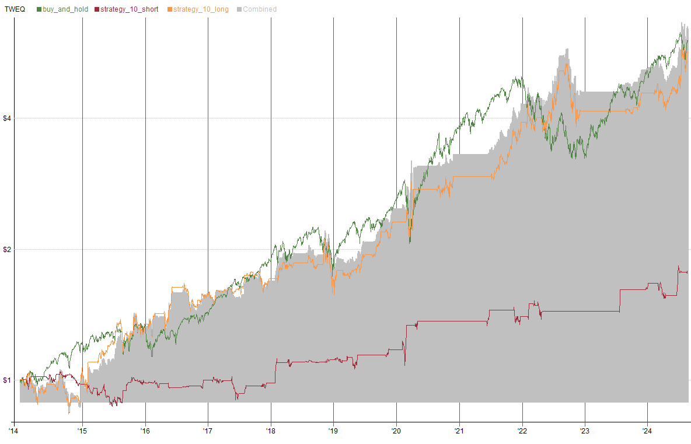
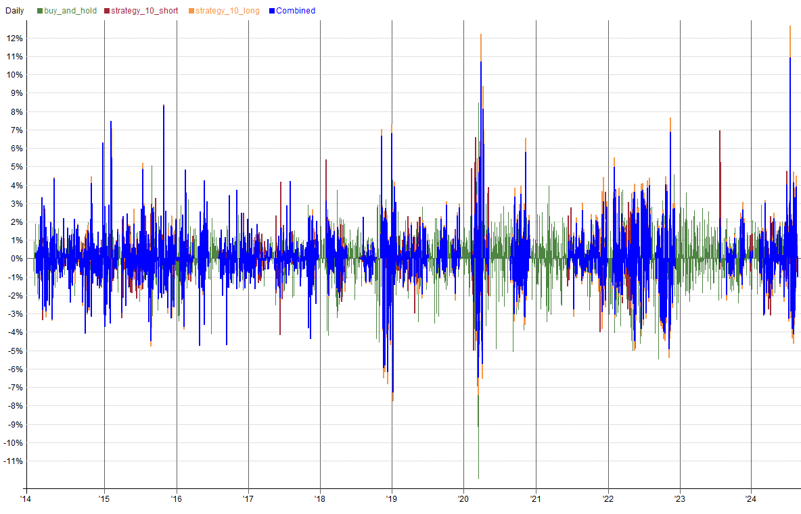
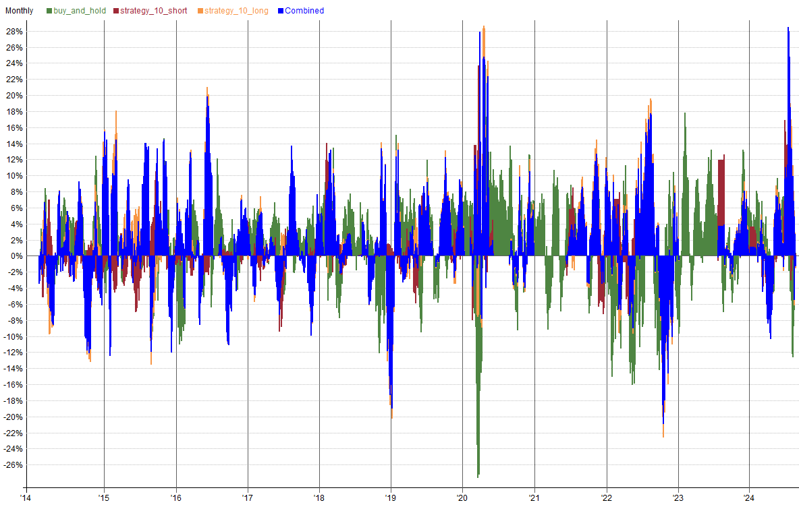
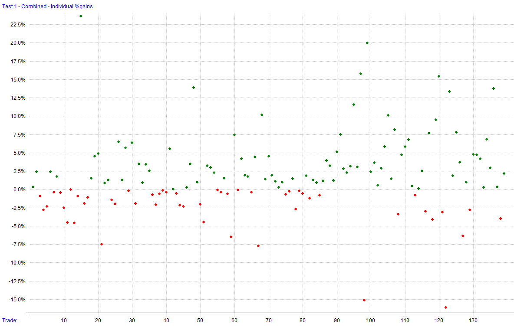
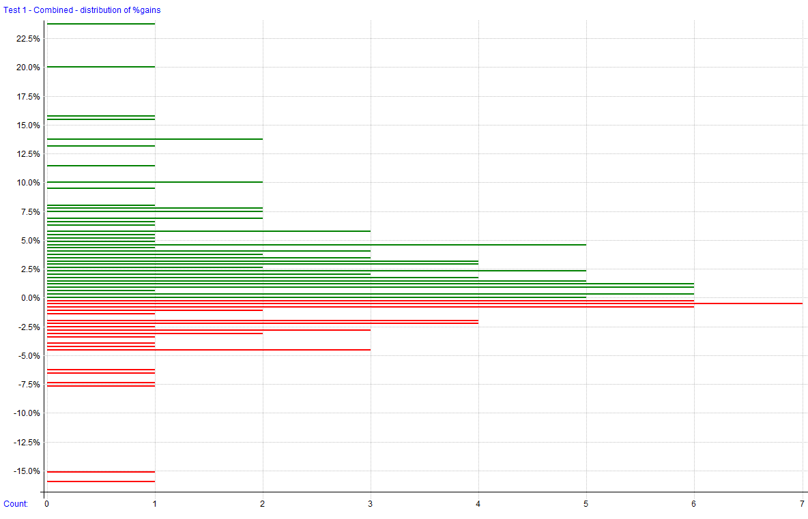
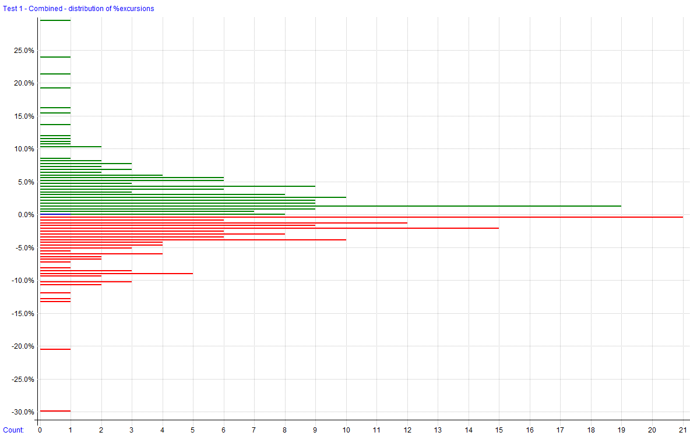
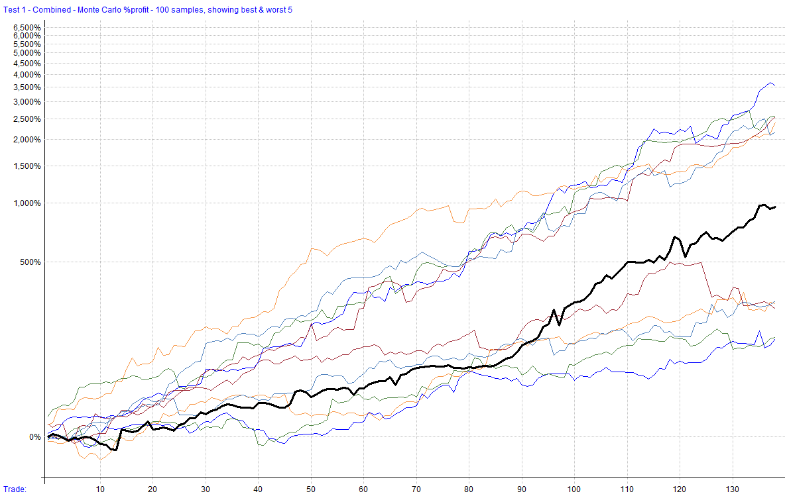
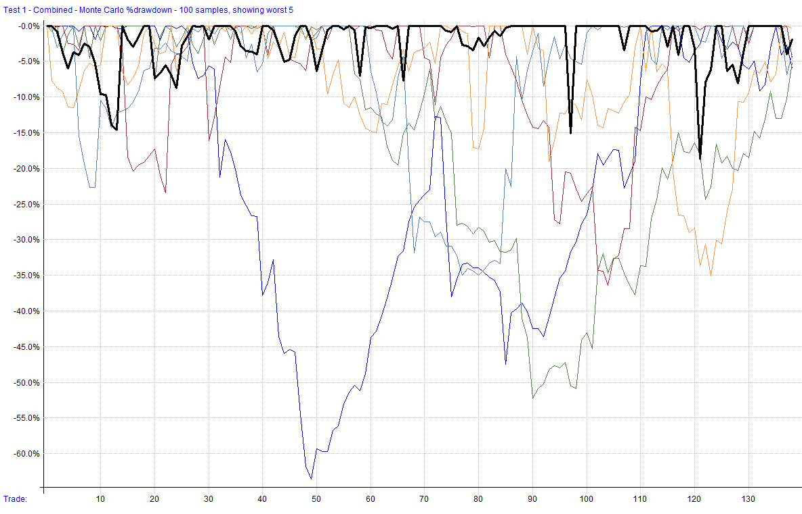

---
aliases:
  - Strategy 9 In Sample Test Results
tags:
  - strategy
  - report
title: Strategy 10
author: Larry Kann
---
# Strategy 10

This strategy is a simple mean reversion strategy designed to complement core rotational equity strategies. It utilizes a boutique linear trend indicator for timing entries, focusing on capturing short-term reversals in Nasdaq 100 stocks.

This file will be updated for as long as the strategy is being developed, deployed (live or simulation), or distributed. Once it has been discontinued, it will be noted here. The code block will always reflect the most recent version of the strategy. The change log can be used to see changes and adjustments to the code over time.

**Strategy Features**:

- Mean Reversion Strategy (long and short)
- Trades stocks in the Nasdaq 100
- Uses the linear trend indicator for entry timing
- Employs liquidity filters to ensure tradability
- Positions are adjusted based on volatility measures
- Max 2 positions (combined for long and short)

**Key Metrics**: _Key metrics are from the latest backtest date in the date range above in the test settings._

- Compound Annual Return: **19.12%** 
- Max Historical Drawdown: **-26.33%**
- Average Holding Period: **25.06 Days**
- Expectancy Per Trade: **3.69%**
- Win Rate: **63.31%**
- Profit Factor: **2.85**
- Sharpe Ratio: **0.96**
- MAR Ratio: **0.73**

**Data Source and Test Settings**: _For transparency._

- **Data Source**: Norgate
- **Universe**: Nasdaq 100 Constituents (current & past for testing)
- **Benchmark**: QQQ
- **Date Range**: 01/01/2014 to 08/21/2024
- **Bar Size**: Daily
- **Backtesting Platform/Engine**: RealTest

**Benchmark**: _This strategy is used to make a comparison to the results of the custom strategy._

- **Benchmark Strategy**: Buy and hold QQQ.
- **Entry Setup**: Enter QQQ.
- **Exit Rule**: Reinvest dividends.

This strategy seeks to capitalize on mean reversion opportunities in the Nasdaq 100 by utilizing the linear trend indicator to time entries. Liquidity filters ensure that only highly tradable stocks are selected. Position sizing is adjusted based on volatility measures. The strategy operates on both the long and short sides.

## Settings

| Setting            | Value                                                |
| ------------------ | ---------------------------------------------------- |
| Bar Size           | Daily                                                |
| Account Size Start | $100,000                                             |
| Data Source        | Norgate                                              |
| Universe           | Nasdaq 100 Constituents (current & past for testing) |
| Benchmark          | QQQ                                                  |
| Date Range         | 01/02/2014 to 08/21/2024                             |
| Platform/Engine    | RealTest                                             |

## Summary Stats
|              | buy_and_hold* | strategy_10_short | strategy_10_long | Combined    |     |
| ------------ | ------------- | ----------------- | ---------------- | ----------- | --- |
| Periods      | 2,677         | 2,649             | 2,668            | 2,668       |     |
| NetProfit    | $503,272      | $77,355           | $461,116         | $538,471    |     |
| Comp         | True          | True              | True             | True        |     |
| ROR          | 18.41%        | 5.60%             | 17.67%           | **19.12%**  |     |
| MaxDD        | -35.11%       | -16.64%           | -28.49%          | **-26.33%** |     |
| MAR          | 0.52          | 0.34              | 0.62             | 0.73        |     |
| Trades       | 45            | 62                | 77               | 139         |     |
| PctWins      | 82.22%        | 58.06%            | 67.53%           | **63.31%**  |     |
| AvgWin       | 7.67%         | 6.26%             | 10.64%           | 8.85%       |     |
| AvgLoss      | 9.94%         | 3.77%             | 6.68%            | 5.20%       |     |
| WinLen       | 60.08         | 9.06              | 26.83            | 19.56       |     |
| LossLen      | 56.62         | 25.19             | 44.28            | 34.55       |     |
| Expectancy   | 4.54%         | 2.05%             | 5.02%            | 3.69%       |     |
| TradeLen     | 59.47         | 15.82             | 32.49            | 25.06       |     |
| ProfitFactor | 3.04          | 2.39              | 2.96             | **2.85**    |     |
| Sharpe       | 0.90          | 0.59              | 0.87             | **0.96**    |     |
| AvgExp       | 99.92%        | 18.89%            | 46.36%           | 57.59%      |     |
| MaxExp       | 100.00%       | 113.32%           | 103.09%          | 209.69%     |     |

*\*benchmark strategies are not included in combined stats*

## Combined Monthly Percent Gains
| YEAR    | Jan      | Feb      | Mar       | Apr       | May      | Jun      | Jul      | Aug      | Sep       | Oct      | Nov      | Dec      | TOTAL     | MaxDD      |     |
| ------- | -------- | -------- | --------- | --------- | -------- | -------- | -------- | -------- | --------- | -------- | -------- | -------- | --------- | ---------- | --- |
| 2014    | -1.4%    | 6.1%     | -6.9%     | -2.5%     | 0.6%     | 4.4%     | -1.3%    | 6.0%     | -9.0%     | -3.1%    | -2.0%    | 11.1%    | **0.1%**  | -18.5%     |     |
| 2015    | -7.9%    | 11.8%    | -0.4%     | 6.9%      | 1.2%     | -1.3%    | 13.9%    | -4.9%    | 3.2%      | 10.1%    | -2.1%    | 0.3%     | **32.3%** | -14.1%     |     |
| 2016    | 1.8%     | 4.5%     | -1.0%     | -6.2%     | 12.2%    | 8.1%     | 0.0%     | -0.4%    | -6.2%     | 0.4%     | 2.8%     | 1.6%     | **17.4%** | -13.6%     |     |
| 2017    | -1.9%    | 4.4%     | 0.1%      | 1.5%      | -5.6%    | 1.3%     | 7.2%     | 4.0%     | -0.4%     | -1.4%    | -4.4%    | 4.1%     | **8.4%**  | -11.4%     |     |
| 2018    | 6.4%     | 5.0%     | 2.5%      | -0.9%     | 1.9%     | 0.0%     | -0.1%    | 1.5%     | -2.2%     | 1.9%     | 5.1%     | -12.6%   | **7.3%**  | -23.0%     |     |
| 2019    | 4.6%     | -1.6%    | -0.3%     | 0.6%      | 3.9%     | 6.7%     | 0.3%     | 0.1%     | 9.1%      | 2.9%     | 3.4%     | 2.4%     | **36.6%** | -7.4%      |     |
| 2020    | 0.0%     | 10.5%    | 4.8%      | 6.3%      | 1.9%     | 0.0%     | 0.0%     | 1.9%     | -1.7%     | -2.7%    | 9.1%     | 0.0%     | **33.3%** | -20.5%     |     |
| 2021    | 0.0%     | 0.0%     | 0.0%      | 0.0%      | 0.0%     | 2.6%     | 1.7%     | 7.6%     | -3.5%     | 9.9%     | -0.6%    | 10.0%    | **30.3%** | -8.2%      |     |
| 2022    | 5.6%     | -1.2%    | 0.6%      | -7.6%     | 8.4%     | 1.7%     | 15.9%    | 3.2%     | -5.2%     | -4.2%    | -7.6%    | -0.6%    | **6.7%**  | -26.3%     |     |
| 2023    | 0.0%     | 0.0%     | 0.0%      | 0.0%      | 0.0%     | 0.0%     | 3.7%     | 0.7%     | -1.7%     | 1.9%     | 7.7%     | 0.3%     | **13.0%** | -2.8%      |     |
| 2024    | 0.8%     | 4.4%     | -6.1%     | -4.1%     | 7.1%     | 7.5%     | 15.9%    | -2.5%    | n/a       | n/a      | n/a      | n/a      | **23.3%** | -11.6%     |     |
| **AVG** | **0.7%** | **4.0%** | **-0.6%** | **-0.6%** | **2.9%** | **2.8%** | **5.2%** | **1.6%** | **-1.8%** | **1.6%** | **1.1%** | **1.7%** | **19.0%** | **-14.3%** |     |

## Strategy Correlations

### RETURNS

|                       | buy_and_hold | strategy_10_short | strategy_10_long | Combined |
| --------------------- | ------------ | ----------------- | ---------------- | -------- |
| **buy_and_hold**      | 1.00         | -0.17             | 0.51             | 0.44     |
| **strategy_10_short** | -0.17        | 1.00              | -0.05            | 0.22     |
| **strategy_10_long**  | 0.51         | -0.05             | 1.00             | 0.96     |
| **Combined**          | 0.44         | 0.22              | 0.96             | 1.00     |

### DRAWDOWNS

|                       | buy_and_hold | strategy_10_short | strategy_10_long | Combined |
| --------------------- | ------------ | ----------------- | ---------------- | -------- |
| **buy_and_hold**      | 1.00         | 0.08              | 0.45             | 0.47     |
| **strategy_10_short** | 0.08         | 1.00              | -0.07            | 0.03     |
| **strategy_10_long**  | 0.45         | -0.07             | 1.00             | 0.97     |
| **Combined**          | 0.47         | 0.03              | 0.97             | 1.00     |

## Visualizations

 
  
 

### Trade Plots

   

## Monte Carlo Analysis

| Percentile   | Net Profit  | CAR        | Max Drawdown |
| ------------ | ----------- | ---------- | ------------ |
| 1%           | 176.69%     | 10.05%     | -43.85%      |
| 5%           | 313.21%     | 14.29%     | -38.17%      |
| 10%          | 421.03%     | 16.81%     | -28.95%      |
| 20%          | 530.39%     | 18.92%     | -23.20%      |
| 50%          | 867.73%     | 23.82%     | -17.39%      |
| 80%          | 1,584.76%   | 30.45%     | -11.80%      |
| 90%          | 1,921.36%   | 32.71%     | -8.32%       |
| 95%          | 2,418.52%   | 35.49%     | -6.94%       |
| 99%          | 6,675.73%   | 48.72%     | -3.42%       |
| **backtest** | **538.47%** | **19.07%** | **-26.33%**  |

---
*Generated by RealTest. These results are subject to change based on parameter adjustments or further development.*