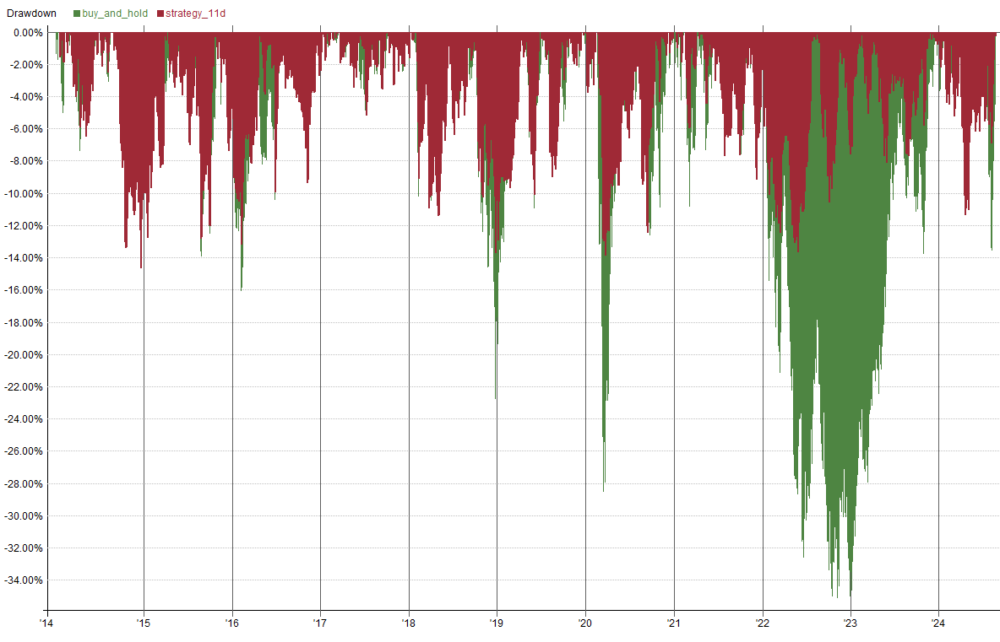
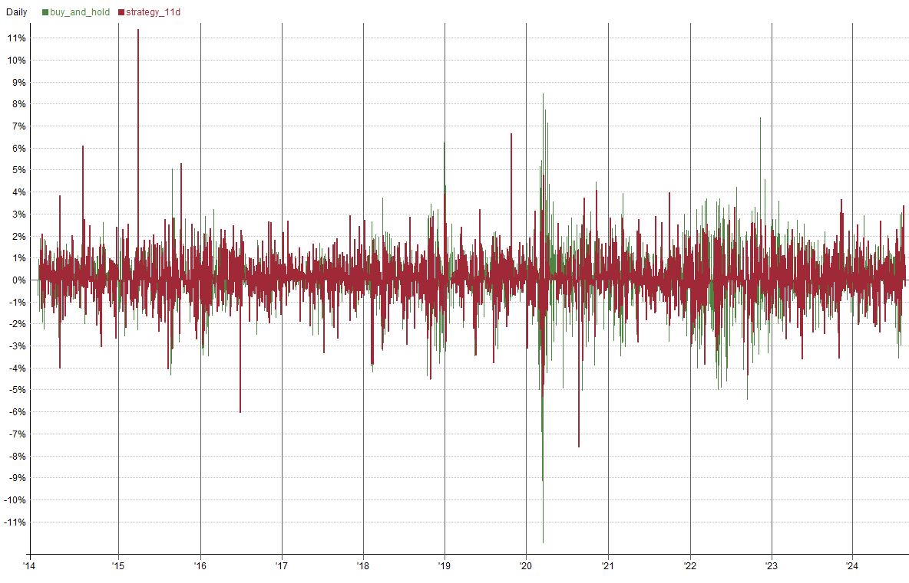
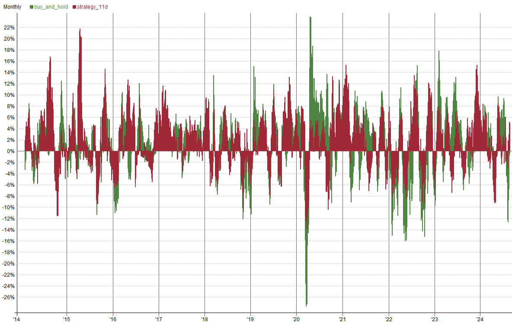
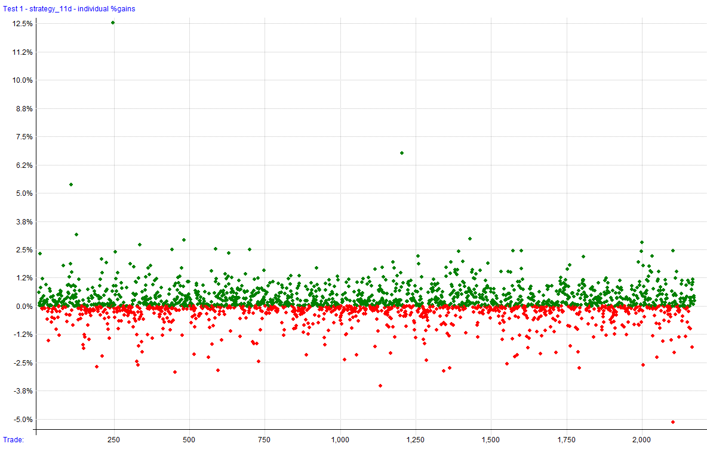
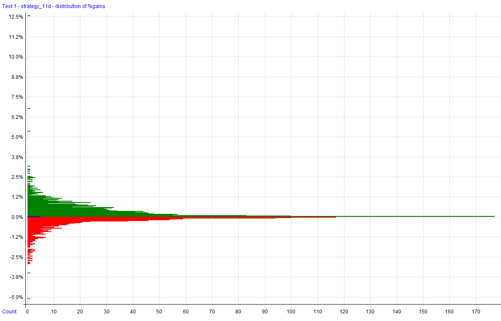
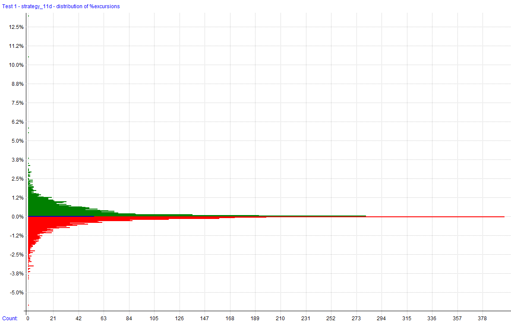
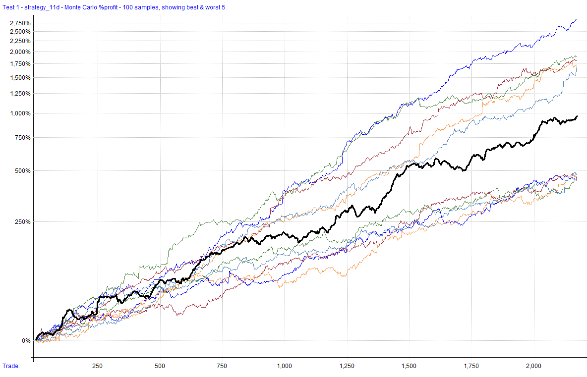
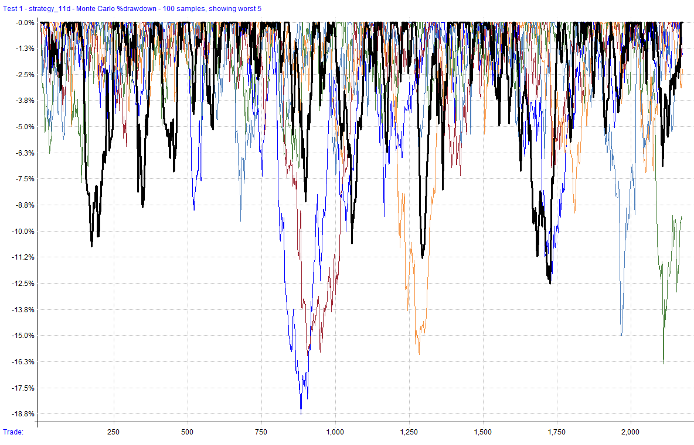

# Strategy 11D

A mean reversion strategy that uses the Stochastic indicator to time entries and exits. The strategy includes a liquidity filter and uses short timeframe EMAs for trend confirmation. This variation uses dynamic sizing and a weekly rebalance instead of the more traditional approach of closing

This file will be updated for as long as the strategy is being developed, deployed (live or simulation), or distributed. Once it has been discontinued, it will be noted here. The change log can be used to see changes and adjustments to the code over time.

**Strategy Features**:

- Mean Reversion Strategy (long and short)
- Trades stocks in the Nasdaq 100
- Utilizes a stochastic indicator for entry timing
- Employs liquidity filters to ensure tradability
- Positions are adjusted dynamically based on market conditions
- Max 5 positions

**Key Metrics**: _Key metrics are from the latest backtest date in the date range above in the test settings._

- Compound Annual Return: **24.15%**
- Max Historical Drawdown: **-14.70%**
- Average Holding Period: **6.43 Days**
- Expectancy Per Trade: **0.08%**
- Win Rate: **57.73%**
- Profit Factor: **1.60**
- Sharpe Ratio: **1.32**
- MAR Ratio: **1.64**

**Data Source and Test Settings**: _For transparency._

- **Data Source**: Norgate
- **Universe**: Nasdaq 100 Constituents (current & past for testing)
- **Benchmark**: QQQ
- **Date Range**: 01/02/2014 to 08/21/2024
- **Bar Size**: Daily
- **Backtesting Platform/Engine**: RealTest

**Benchmark**: _This strategy is used to make a comparison to the results of the custom strategy. It is a simple buy and hold strategy that reinvests dividends._

- **Benchmark Strategy**: Buy and hold QQQ.
- **Entry Setup**: Enter QQQ.
- **Exit Rule**: Reinvest dividends

This strategy aims to exploit mean reversion opportunities in the Nasdaq 100 by utilizing the stochastic oscillator to time entries. A liquidity filter ensures that only highly tradable stocks are considered. Position sizing is dynamically adjusted based on market conditions and volatility (11D). The strategy operates on both the long and short sides, offering flexibility in capturing reversals.

## Settings

| Setting            | Value                                                |
| ------------------ | ---------------------------------------------------- |
| Bar Size           | Daily                                                |
| Account Size Start | $100,000                                             |
| Data Source        | Norgate                                              |
| Universe           | Nasdaq 100 Constituents (current & past for testing) |
| Benchmark          | QQQ                                                  |
| Date Range         | 01/02/2014 to 08/21/2024                             |
| Platform/Engine    | RealTest                                             |

## Summary Stats (Strategy 11d)

|              | buy_and_hold* | strategy_11d |
| ------------ | ------------- | ------------ |
| Periods      | 2,677         | 2,670        |
| NetProfit    | $503,272      | $891,006     |
| Comp         | True          | True         |
| ROR          | 18.41%        | **24.15%**   |
| MaxDD        | -35.11%       | **-14.70%**  |
| MAR          | 0.52          | **1.64**     |
| Trades       | 45            | 2,174        |
| PctWins      | 82.22%        | **57.73%**   |
| AvgWin       | 7.67%         | 4.03%        |
| AvgLoss      | 9.94%         | 5.35%        |
| WinLen       | 60.08         | 6.43         |
| LossLen      | 56.62         | 10.64        |
| Expectancy   | 4.54%         | 0.08%        |
| TradeLen     | 59.47         | Not Provided |
| ProfitFactor | 3.04          | **1.60**     |
| Sharpe       | 0.90          | **1.32**     |
| AvgExp       | 99.92%        | 79.81%       |
| MaxExp       | 100.00%       | 101.74%      |

_*benchmark strategies are not included in combined stats_

## Combined Monthly Percent Gains

| YEAR  | Jan   | Feb   | Mar   | Apr   | May   | Jun   | Jul   | Aug   | Sep   | Oct   | Nov   | Dec   | **TOTAL** | MaxDD   |
| ----- | ----- | ----- | ----- | ----- | ----- | ----- | ----- | ----- | ----- | ----- | ----- | ----- | -------- | ------- |
| 2014  | 3.2%  | 5.9%  | -1.3% | -2.5% | 2.9%  | 4.3%  | 11.6% | 7.2%  | -4.7% | -2.7% | 1.0%  | -1.4% | **24.6%**  | -14.7%  |
| 2015  | 0.4%  | 5.3%  | 11.6% | 4.4%  | 0.0%  | -0.8% | 4.0%  | -8.7% | -2.0% | 10.4% | 4.0%  | -2.7% | **27.0%**  | -12.8%  |
| 2016  | -5.1% | 2.9%  | 0.4%  | 12.6% | 2.9%  | -1.4% | 3.6%  | -1.6% | 0.2%  | -3.3% | 2.9%  | 2.1% | **16.4%**  | -10.0%  |
| 2017  | 12.0% | 5.2%  | 5.3%  | 2.7%  | -1.0% | 3.9%  | -0.4% | 5.2%  | 1.1%  | 1.8%  | 0.7%  | 2.0% | **45.1%**  | -5.2%   |
| 2018  | 8.7%  | -5.3% | -2.2% | -3.6% | 6.3%  | 1.8%  | 1.5%  | 3.2%  | 2.5%  | -7.1% | 0.9%  | -4.3%| **1.1%**   | -13.7%  |
| 2019  | 1.4%  | 0.7%  | 6.0%  | 3.9%  | -7.1% | 10.2% | 2.9%  | -5.9% | 7.8%  | 9.8%  | 1.1%  | 5.1% | **40.0%**  | -10.1%  |
| 2020  | -3.3% | 4.8%  | -7.6% | 2.5%  | 5.4%  | -0.6% | 2.4%  | -3.5% | 2.6%  | 0.2%  | 10.1% | 9.1% | **22.9%**  | -13.9%  |
| 2021  | 9.3%  | 1.8%  | 6.2%  | 4.3%  | 4.2%  | 1.0%  | -5.8% | 3.5%  | -2.6% | 3.9%  | -1.0% | 6.0% | **34.4%**  | -9.2%   |
| 2022  | -5.0% | -3.7% | 3.6%  | -5.9% | 1.8%  | 2.3%  | 11.3% | -1.5% | -5.8% | 6.3%  | 10.0% | -5.1%| **6.3%**   | -12.6%  |
| 2023  | 6.7%  | 0.5%  | 6.2%  | -1.4% | -4.6% | 5.3%  | -1.0% | -2.9% | 3.2%  | -1.7% | 14.6% | 6.0% | **33.7%**  | -8.1%   |
| 2024  | 2.9%  | 0.8%  | 2.8%  | -9.9% | 6.6%  | 1.7%  | -0.6% | 7.8%  | n/a   | n/a   | n/a   | n/a  | **11.5%**  | -11.4%  |
| **AVG**| **2.8%**| **1.7%**| **2.8%**| **0.7%**| **1.6%**| **2.5%**| **2.7%**| **0.3%**| **0.2%**| **1.8%**| **4.4%**| **1.7%**| **23.9%** | **-11.1%** |

## Strategy Correlations

<table class='w3-table' style='border:1px solid black'>
<tr style='border-bottom:1px solid black'>
<td style = 'border-right:1px solid black;text-align:center'><b>RETURNS</b></td>
<th scope='col' bgcolor=#F0F0F0 style='text-align:center;color:#4E8542'>buy_and_hold</th>
<th scope='col' bgcolor=#F0F0F0 style='text-align:center;color:#9F2936'>strategy_11d</th>
</tr>
<tr>
<th scope='row' bgcolor=#F0F0F0 style='text-align:right;border-right:1px solid black;color:#4E8542'>buy_and_hold</th>
<td bgcolor=#00FF00 style='text-align:center'>1.00</td>
<td bgcolor=#60FF60 style='text-align:center'>0.62</td>
</tr>
<tr>
<th scope='row' bgcolor=#F0F0F0 style='text-align:right;border-right:1px solid black;color:#9F2936'>strategy_11d</th>
<td bgcolor=#60FF60 style='text-align:center'>0.62</td>
<td bgcolor=#00FF00 style='text-align:center'>1.00</td>
</tr>
</table>

<!-- Add a blank line here to separate blocks -->

<table class='w3-table' style='border:1px solid black'>
<tr style='border-bottom:1px solid black'>
<td style = 'border-right:1px solid black;text-align:center'><b>DRAWDOWNS</b></td>
<th scope='col' bgcolor=#F0F0F0 style='text-align:center;color:#4E8542'>buy_and_hold</th>
<th scope='col' bgcolor=#F0F0F0 style='text-align:center;color:#9F2936'>strategy_11d</th>
</tr>
<tr>
<th scope='row' bgcolor=#F0F0F0 style='text-align:right;border-right:1px solid black;color:#4E8542'>buy_and_hold</th>
<td bgcolor=#00FF00 style='text-align:center'>1.00</td>
<td bgcolor=#A2FFA2 style='text-align:center'>0.36</td>
</tr>
<tr>
<th scope='row' bgcolor=#F0F0F0 style='text-align:right;border-right:1px solid black;color=#9F2936'>strategy_11d</th>
<td bgcolor=#A2FFA2 style='text-align:center'>0.36</td>
<td bgcolor=#00FF00 style='text-align:center'>1.00</td>
</tr>
</table>

<!-- End of HTML block -->

## Visualizations

### Trade Plots

## Monte Carlo Analysis

| Percentile   | Net Profit  | CAR        | Max Drawdown |
| ------------ | ----------- | ---------- | ------------ |
| 1%           | 452.06%     | 17.45%     | -19.18%      |
| 5%           | 481.95%     | 18.03%     | -13.72%      |
| 10%          | 567.69%     | 19.57%     | -12.94%      |
| 20%          | 698.35%     | 21.60%     | -11.16%      |
| 50%          | 945.79%     | 24.73%     | -8.07%       |
| 80%          | 1,218.74%   | 27.48%     | -5.95%       |
| 90%          | 1,440.31%   | 29.36%     | -5.04%       |
| 95%          | 1,733.69%   | 31.50%     | -4.33%       |
| 99%          | 2,855.42%   | 37.54%     | -3.33%       |
| **backtest** | **891.01%** | **24.10%** | **-14.70%**  |

