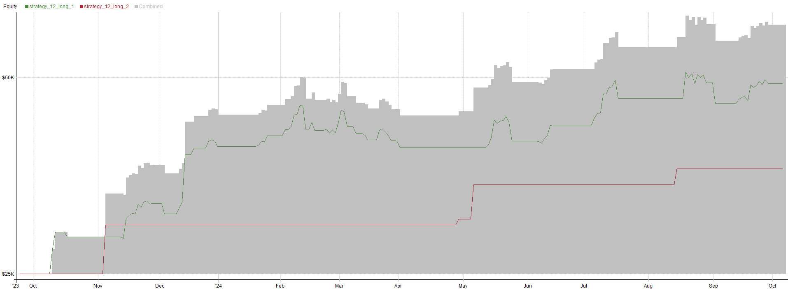
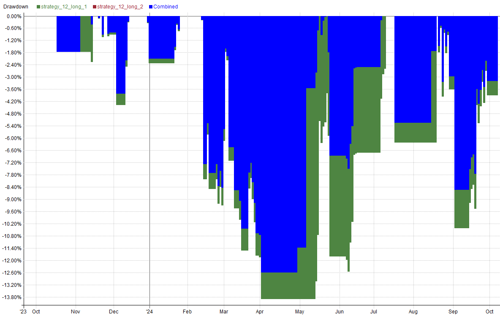
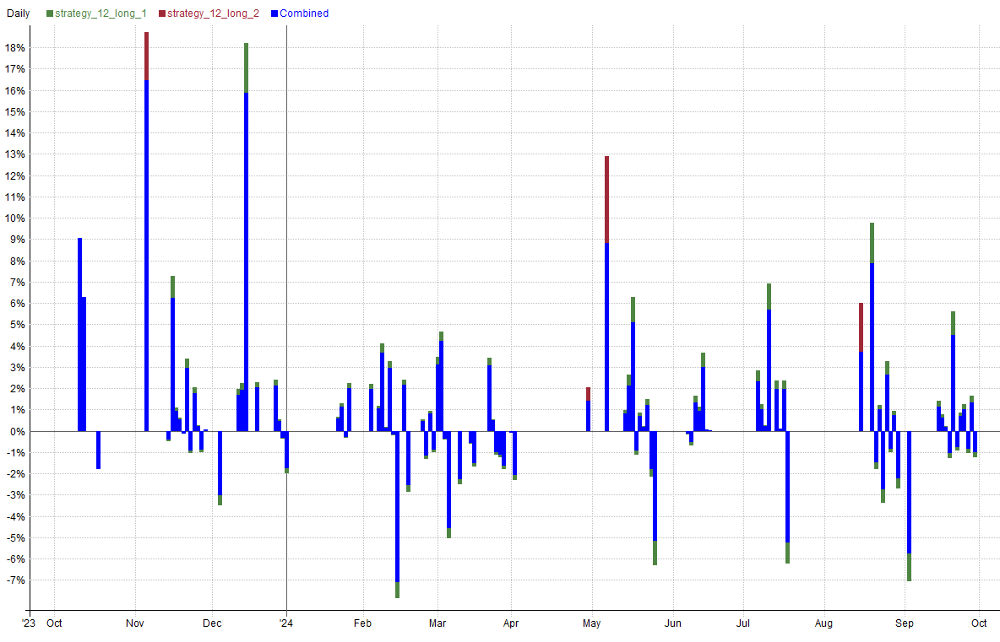
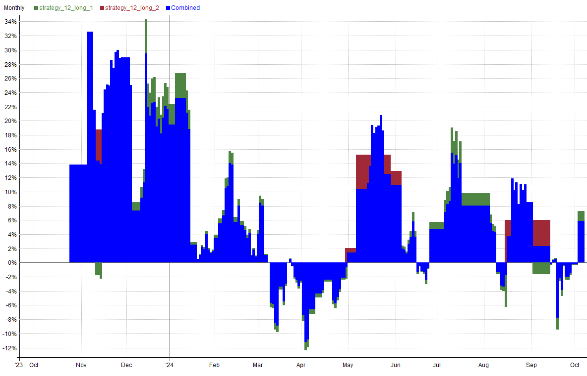
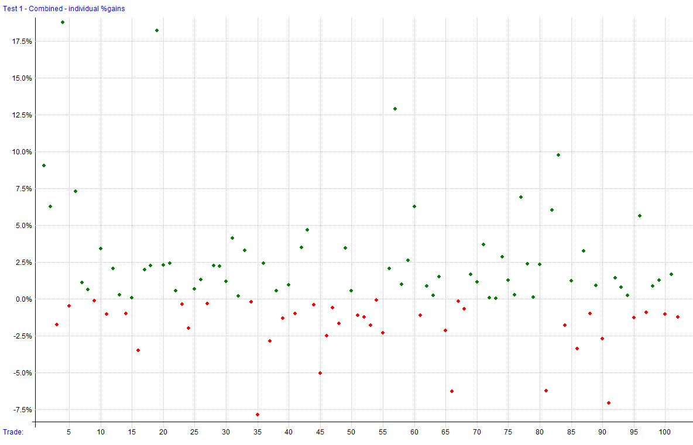
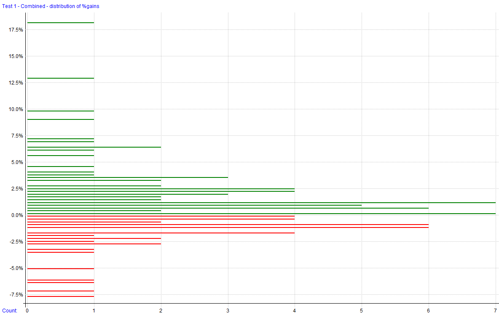
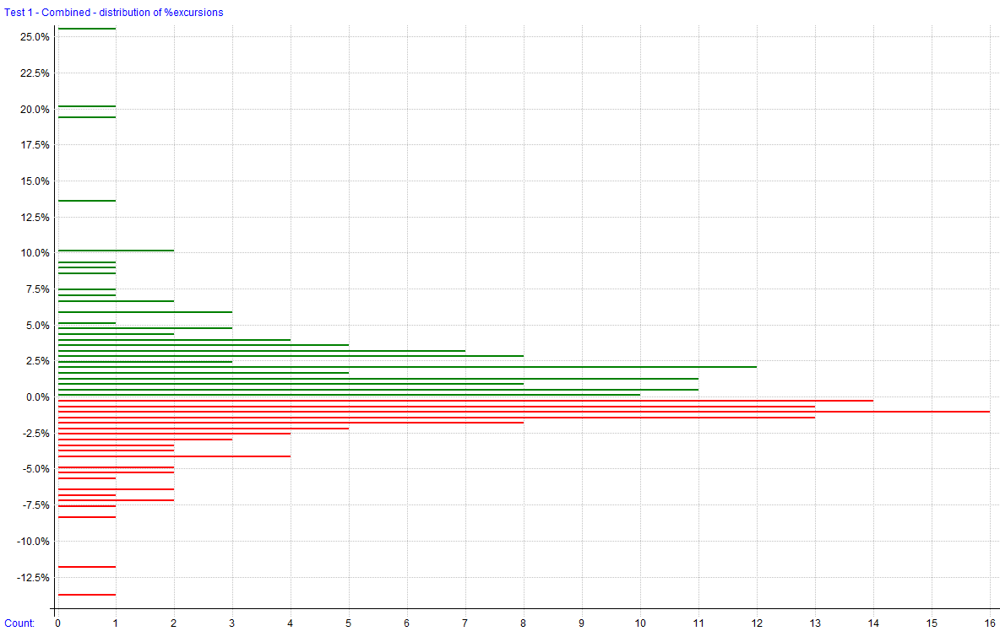
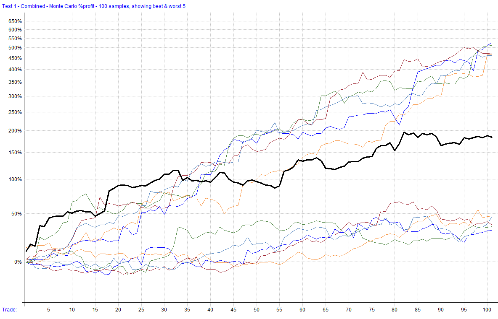
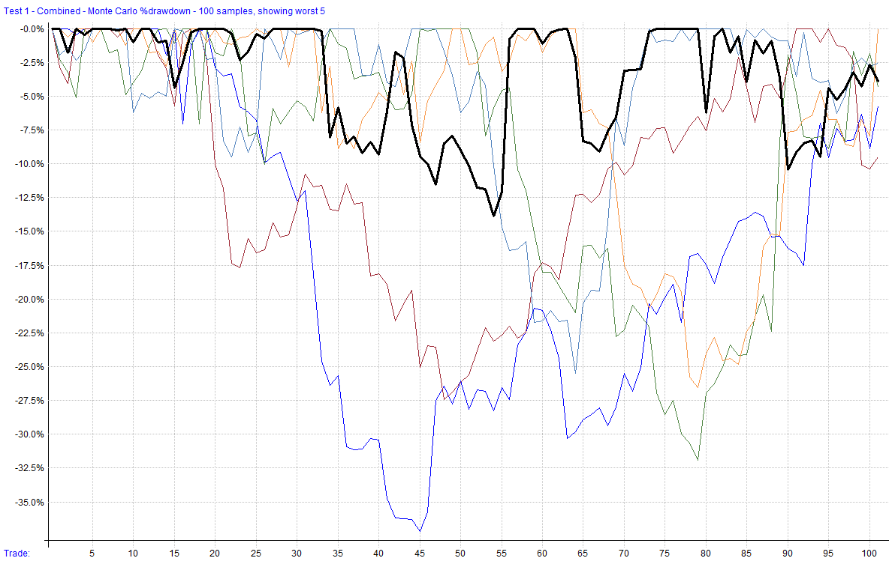

# Strategy 12

A day trading futures strategy that leverages the VIX/SPY relationship to define trade entries and exits. It incorporates dynamic position sizing based on volatility and entry type, ensuring trades are executed with optimal risk management. Trades are closed at the end of each trading day to mimic the operations of proprietary funds.

This file will be updated for as long as the strategy is being developed, deployed (live or simulation), or distributed. Once it has been discontinued, it will be noted here. The code block will always reflect the most recent version of the strategy. The change log can be used to see changes and adjustments to the code over time.

**Strategy Features**:

- Day Trading Futures Strategy (Long Only)
- Trades Micro E-mini S&P 500 (MES)
- Utilizes linear regression bands to time entries.
- Implements dynamic position sizing based on volatility and entry type.
- Closes all positions at the end of each trading day.
- Uses CMMA for momentum measurement.
- Maximum Positions: 20 micro contracts

**Key Metrics**: _Key metrics are from the latest backtest date in the date range above in the test settings._

- Compound Annual Return: **143.93%**
- Max Historical Drawdown: **-12.59%**
- Average Holding Period: **1 Day**
- Expectancy Per Trade: **0.13%**
- Win Rate: **61.76%**
- Profit Factor: **2.03**
- Sharpe Ratio: **2.67**
- MAR Ratio: **11.43**

**Data Source and Test Settings**: _For transparency._

- **Data Source**: Norgate
- **Universe**: Micro E-mini S&P 500 (MES) and VIX
- **Date Range**: 09/25/2023 to 10/04/2024
- **Bar Size**: Daily
- **Backtesting Platform/Engine**: RealTest

## Settings

| Setting            | Value                                        |
| ------------------ | -------------------------------------------- |
| Bar Size           | Daily                                        |
| Account Size Start | $25,000                                      |
| Data Source        | Norgate                                      |
| Universe           | Micro E-mini S&P 500 (MES) and VIX           |
| Date Range         | 09/25/2023 to 10/04/2024                     |
| Platform/Engine    | RealTest                                     |

## Summary Stats (Strategy 12)

|              | strategy_12_long_1 | strategy_12_long_2 | Combined    |
| ------------ | ------------------ | ------------------ | ----------- |
| Periods      | 249                | 231                | 249         |
| NetProfit    | $23,940            | $11,265            | $35,205     |
| Comp         | True               | True               | True        |
| ROR          | 97.69%             | 9,044,859.74%      | **143.93%** |
| MaxDD        | -13.89%            | -0.00%             | **-12.59%** |
| MAR          | 7.03               | 0.00               | **11.43**   |
| Trades       | 98                 | 4                  | 102         |
| PctWins      | 60.20%             | 100.00%            | **61.76%**  |
| AvgWin       | 0.44%              | 0.58%              | 0.45%       |
| AvgLoss      | 0.40%              | 0.00%              | 0.40%       |
| WinLen       | 0.00               | 0.00               | 0.00        |
| LossLen      | 0.00               | 0.00               | 0.00        |
| Expectancy   | 0.11%              | 0.58%              | **0.13%**   |
| ProfitFactor | 1.70               | 0.00               | **2.03**    |
| Sharpe       | 2.12               | 1.77               | **2.67**    |
| AvgExp       | 0.00%              | 0.00%              | 0.00%       |
| MaxExp       | 0.00%              | 0.00%              | 0.00%       |

## Combined Monthly Percent Gains

| YEAR | Jan  | Feb  | Mar    | Apr    | May   | Jun  | Jul  | Aug  | Sep    | Oct    | Nov    | Dec    | **TOTAL** | MaxDD   |
| ---- | ---- | ---- | ------ | ------ | ----- | ---- | ---- | ---- | ------ | ------ | ------ | ------ | -------- | ------- |
| 2023 | n/a  | n/a  | n/a    | n/a    | n/a   | n/a  | n/a  | n/a  | 0.0%   | 13.8%  | 28.9%  | 19.5%  | **75.3%** | -3.8%   |
| 2024 | 3.5% | 4.1% | **-5.5%** | **-0.7%** | 11.0% | 4.7% | 8.0% | 8.5% | **-0.2%** | 0.0%   | n/a    | n/a    | **37.4%** | -12.6%  |
| **AVG** | **3.5%** | **4.1%** | **-5.5%** | **-0.7%** | **11.0%** | **4.7%** | **8.0%** | **8.5%** | **-0.1%** | **6.9%** | **28.9%** | **19.5%** | **56.3%** | **-8.2%** |

## Strategy Correlations

<table class='w3-table' style='border:1px solid black'>
  <tr style='border-bottom:1px solid black'>
    <td style='border-right:1px solid black;text-align:center'><b>RETURNS</b></td>
    <th scope='col' bgcolor="#F0F0F0" style='text-align:center;color:#4E8542'>strategy_12_long_1</th>
    <th scope='col' bgcolor="#F0F0F0" style='text-align:center;color:#9F2936'>strategy_12_long_2</th>
    <th scope='col' bgcolor="#F0F0F0" style='text-align:center;color:#F79646'>Combined</th>
  </tr>
  <tr>
    <th scope='row' bgcolor="#F0F0F0" style='text-align:right;border-right:1px solid black;color:#4E8542'>strategy_12_long_1</th>
    <td bgcolor="#00FF00" style='text-align:center'>1.00</td>
    <td bgcolor="#FFFBFB" style='text-align:center'>-0.01</td>
    <td bgcolor="#28FF28" style='text-align:center'>0.84</td>
  </tr>
  <tr>
    <th scope='row' bgcolor="#F0F0F0" style='text-align:right;border-right:1px solid black;color:#9F2936'>strategy_12_long_2</th>
    <td bgcolor="#FFFBFB" style='text-align:center'>-0.01</td>
    <td bgcolor="#00FF00" style='text-align:center'>1.00</td>
    <td bgcolor="#7AFF7A" style='text-align:center'>0.52</td>
  </tr>
  <tr>
    <th scope='row' bgcolor="#F0F0F0" style='text-align:right;border-right:1px solid black;color:#F79646'>Combined</th>
    <td bgcolor="#28FF28" style='text-align:center'>0.84</td>
    <td bgcolor="#7AFF7A" style='text-align:center'>0.52</td>
    <td bgcolor="#00FF00" style='text-align:center'>1.00</td>
  </tr>
</table>

<!-- Add a blank line here to separate blocks -->

<table class='w3-table' style='border:1px solid black'>
  <tr style='border-bottom:1px solid black'>
    <td style='border-right:1px solid black;text-align:center'><b>DRAWDOWNS</b></td>
    <th scope='col' bgcolor="#F0F0F0" style='text-align:center;color:#4E8542'>strategy_12_long_1</th>
    <th scope='col' bgcolor="#F0F0F0" style='text-align:center;color:#9F2936'>strategy_12_long_2</th>
    <th scope='col' bgcolor="#F0F0F0" style='text-align:center;color:#F79646'>Combined</th>
  </tr>
  <tr>
    <th scope='row' bgcolor="#F0F0F0" style='text-align:right;border-right:1px solid black;color:#4E8542'>strategy_12_long_1</th>
    <td bgcolor="#00FF00" style='text-align:center'>1.00</td>
    <td bgcolor="#000000" style='text-align:center'>0.00</td>
    <td bgcolor="#19FF19" style='text-align:center'>0.90</td>
  </tr>
  <tr>
    <th scope='row' bgcolor="#F0F0F0" style='text-align:right;border-right:1px solid black;color:#9F2936'>strategy_12_long_2</th>
    <td bgcolor="#000000" style='text-align:center'>0.00</td>
    <td bgcolor="#000000" style='text-align:center'>0.00</td>
    <td bgcolor="#000000" style='text-align:center'>0.00</td>
  </tr>
  <tr>
    <th scope='row' bgcolor="#F0F0F0" style='text-align:right;border-right:1px solid black;color:#F79646'>Combined</th>
    <td bgcolor="#19FF19" style='text-align:center'>0.90</td>
    <td bgcolor="#000000" style='text-align:center'>0.00</td>
    <td bgcolor="#00FF00" style='text-align:center'>1.00</td>
  </tr>
</table>

<!-- End of HTML block -->

## Visualizations

### Trade Plots

## Monte Carlo Analysis

| Percentile | Net Profit | CAR      | Max Drawdown |
|------------|------------|----------|--------------|
| 1%         | 34.25%     | 33.04%   | -28.11%      |
| 5%         | 54.79%     | 52.73%   | -21.94%      |
| 10%        | 68.30%     | 65.62%   | -20.01%      |
| 20%        | 98.67%     | 94.51%   | -17.99%      |
| 50%        | 172.32%    | 164.05%  | -12.92%      |
| 80%        | 300.03%    | 283.33%  | -9.19%       |
| 90%        | 368.85%    | 347.09%  | -7.85%       |
| 95%        | 467.12%    | 437.63%  | -6.28%       |
| 99%        | 683.38%    | 635.30%  | -6.20%       |
| **backtest** | **140.82%** | **134.39%** | **-12.59%** |

