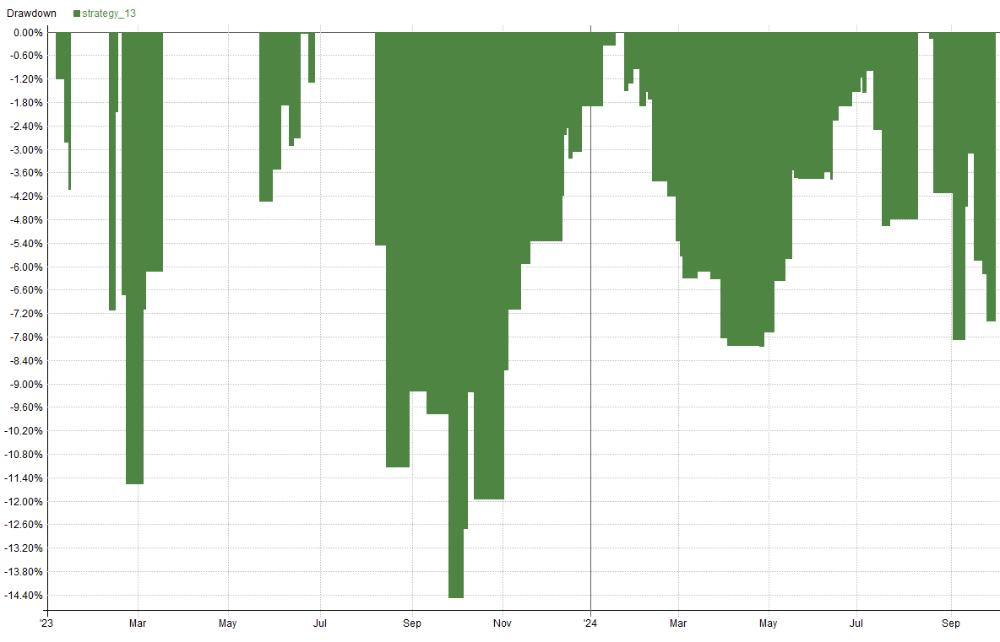
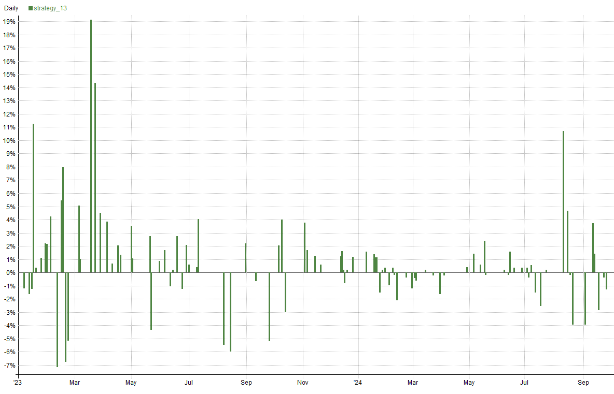
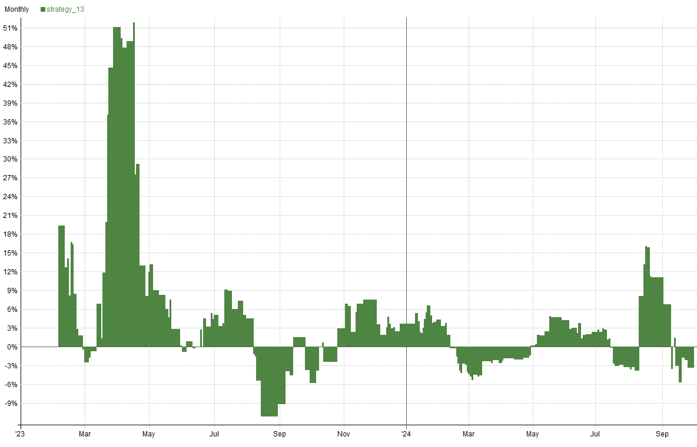
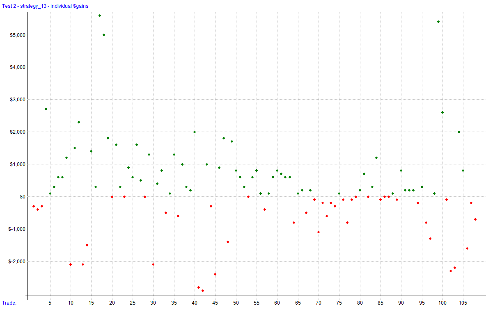
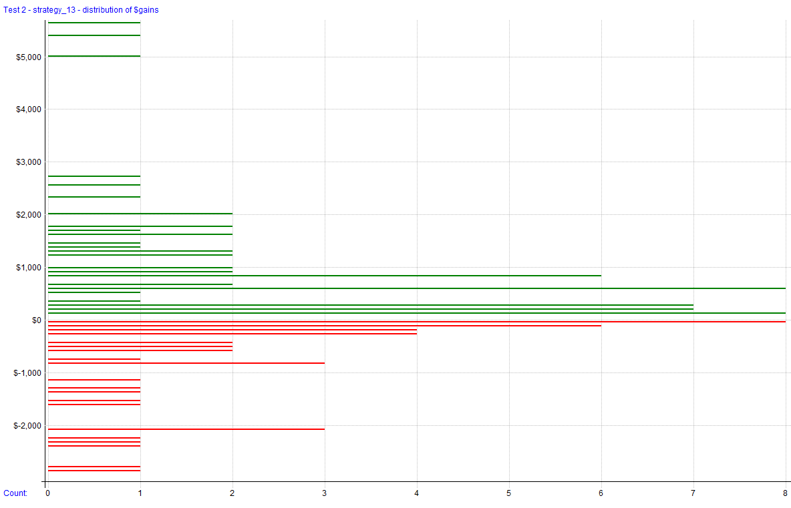
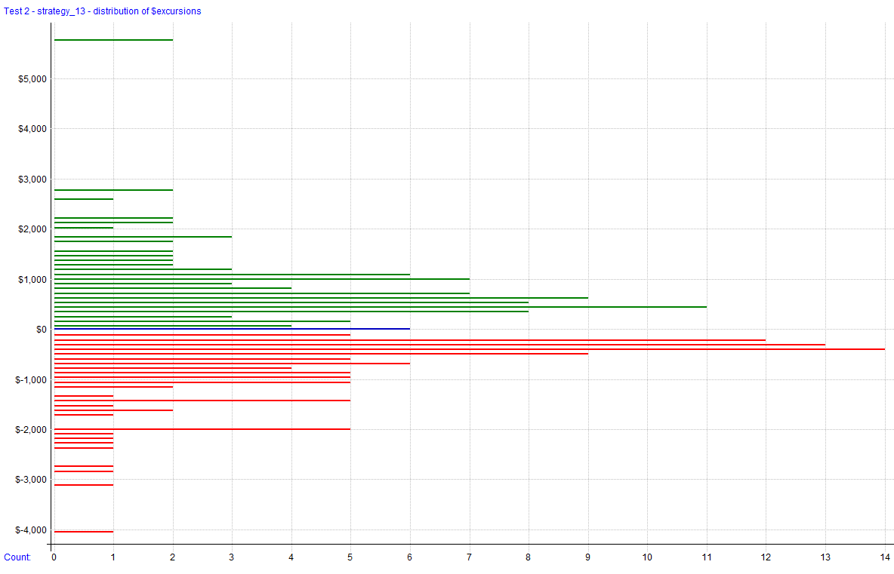
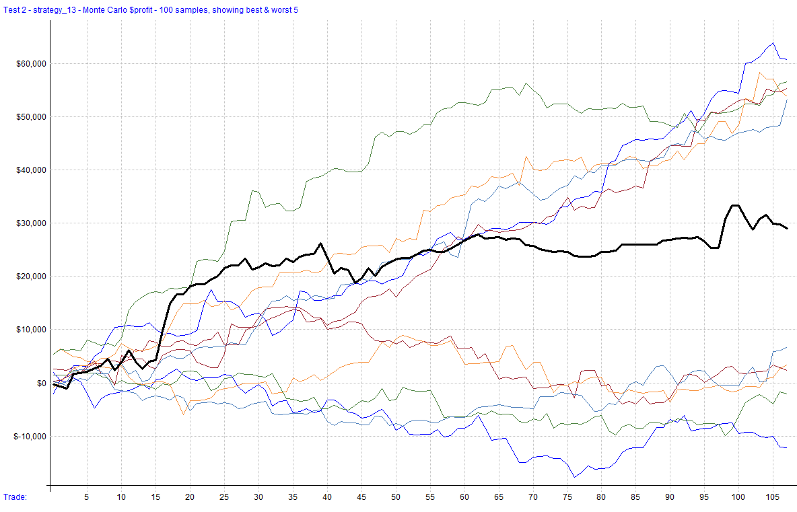
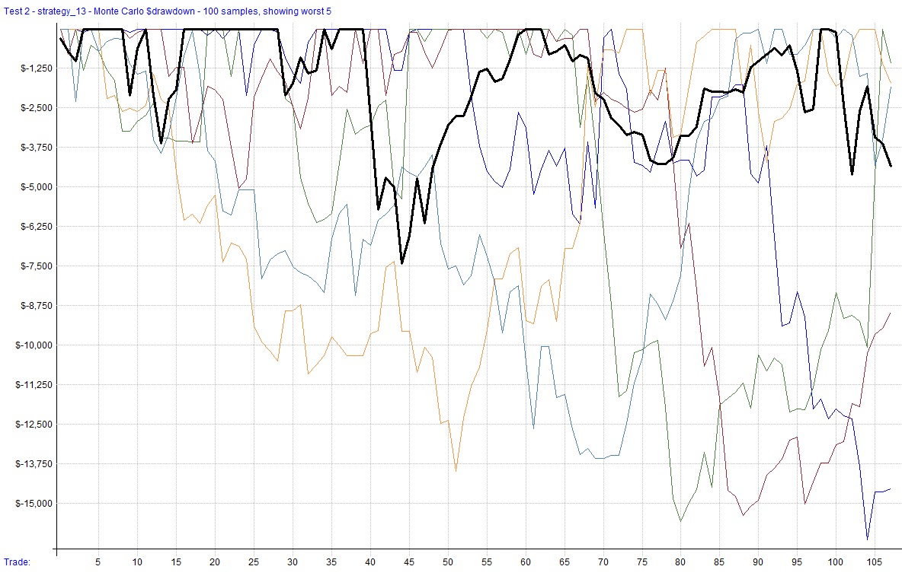

# Strategy 13

A day trading futures strategy that leverages the VIX/SPY relationship to define trade entries and exits. It utilizes the money flow indicator based on SPY performance to determine optimal times to short VX futures. Trades are executed on a per-day basis and closed at the end of each trading day to mimic the operations of proprietary funds. The strategy employs dynamic position sizing based on volatility and entry type, ensuring trades are managed with disciplined risk control.

This file will be updated for as long as the strategy is being developed, deployed (live or simulation), or distributed. Once it has been discontinued, it will be noted here. The code block will always reflect the most recent version of the strategy. The change log can be used to see changes and adjustments to the code over time.

It's important to note that this strategy is meant to show how the relationship between different assets can be used to help find an edge for a trading strategy. It is possible that this strategy would be better as a scan feature and used to assist manual trading if looking to trade some short positions or hedge long positions in ES. It isn't perfect, which is why it is measured per day, and no other trade criteria is used. That means minimal parameters for optimization and closing trades each day. 

This strategy trades 2 contracts as that is the average maximum amount of full-sized contracts that can be traded on a small prop firm account. 

**Strategy Features**:

- Day Trading Futures Strategy (Short Only)
- Trades VX Futures
- Utilizes the money flow indicator to time entries based on SPX performance
- Closes all positions at the end of each trading day
- Maximum Positions: 2 contracts

**Key Metrics**: _Key metrics are from the latest backtest date in the date range above in the test settings._

- Compound Annual Return: **66.77%**
- Max Historical Drawdown: **-14.48%**
- Average Holding Period: **1 Day**
- Expectancy Per Trade: **0.59%**
- Win Rate: **58.33%**
- Profit Factor: **1.84**
- Sharpe Ratio: **1.67**
- MAR Ratio: **4.61**

**Data Source and Test Settings**: _For transparency._

- **Data Source**: Norgate
- **Universe**: VX Futures
- **Date Range**: 01/01/2023 to 09/30/2024
- **Bar Size**: Daily
- **Backtesting Platform/Engine**: RealTest

## Settings

| Setting            | Value                              |
| ------------------ | ---------------------------------- |
| Bar Size           | Daily                               |
| Account Size Start | $25,000                             |
| Data Source        | Norgate                             |
| Universe           | VX Futures                          |
| Date Range         | 01/01/2023 to 09/30/2024            |
| Platform/Engine    | RealTest                            |

## Summary Stats (Strategy 13)

|              | strategy_13 |
| ------------ | ----------- |
| **Periods**      | 438         |
| **NetProfit**    | $29,068     |
| **Comp**         | False       |
| **ROR**          | 66.77%      |
| **MaxDD**        | **-14.48%** |
| **MAR**          | 4.61        |
| **Trades**       | 108         |
| **PctWins**      | **58.33%**  |
| **AvgWin**       | 2.72%       |
| **AvgLoss**      | 2.39%       |
| **WinLen**       | 0.00        |
| **LossLen**      | 0.00        |
| **Expectancy**   | **0.59%**   |
| **ProfitFactor** | **1.84**    |
| **Sharpe**       | **1.67**    |
| **AvgExp**       | 0.00%       |
| **MaxExp**       | 0.00%       |

## Combined Monthly Percent Gains

| YEAR | Jan   | Feb    | Mar    | Apr   | May   | Jun  | Jul  | Aug    | Sep    | Oct  | Nov | Dec | **TOTAL** | MaxDD   |
| ---- | ----- | ------ | ------ | ----- | ----- | ---- | ---- | ------ | ------ | ---- | --- | --- | -------- | ------- |
| 2023 | 13.1% | -2.9%  | 56.3%  | 19.9% | 0.3%  | 9.5% | 8.8% | -18.8% | -10.8% | 5.2% | 13.5% | 7.1% | **101.1%** | -29.7% |
| 2024 | 8.7%  | -9.3%  | -5.3%  | 0.4%  | 8.3%  | 4.7% | -6.9% | 22.3%  | -7.7%  | n/a  | n/a | n/a | **15.2%**  | -18.4%  |
| **AVG** | **10.9%** | **-6.1%** | **25.5%** | **10.1%** | **4.3%** | **7.1%** | **0.9%** | **1.7%** | **-9.3%** | **5.2%** | **13.5%** | **7.1%** | **58.1%** | **-24.1%** |

## Visualizations

### Trade Plots

## Monte Carlo Analysis

The results for this strategy are less pleasing when looking at the Monte-Carlo charts. The range is wide and leads me to believe that this strategy may not be that robust. This could be due to the minimal trade entry criteria or indicate that the money flow indicator is not the best vessel to trade this relationship. 

| Percentile | Net Profit  | AAR     | Max Drawdown    |
| ---------- | ----------- | ------- | ---------------- |
| 1%         | **($2,132)** | ($1,227) | **($17,800)**    |
| 5%         | $9,668      | $5,562  | **($14,136)**    |
| 10%        | $12,568     | $7,231  | **($11,636)**    |
| 20%        | $16,468     | $9,475  | **($9,652)**     |
| 50%        | $27,868     | $16,034 | **($7,420)**     |
| 80%        | $43,168     | $24,836 | **($5,028)**     |
| 90%        | $48,868     | $28,116 | **($3,816)**     |
| 95%        | $53,868     | $30,993 | **($3,512)**     |
| 99%        | $64,368     | $37,034 | **($3,020)**     |
| **backtest** | **$29,068** | **$16,724** | **($7,420)** |

