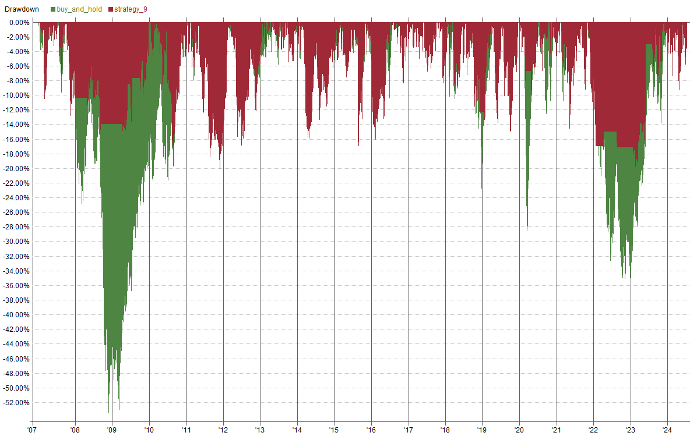
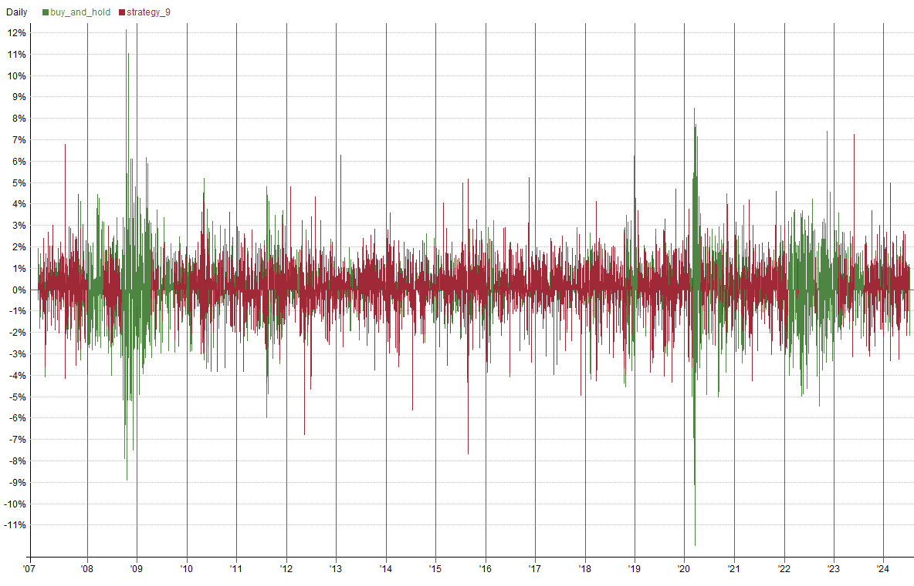
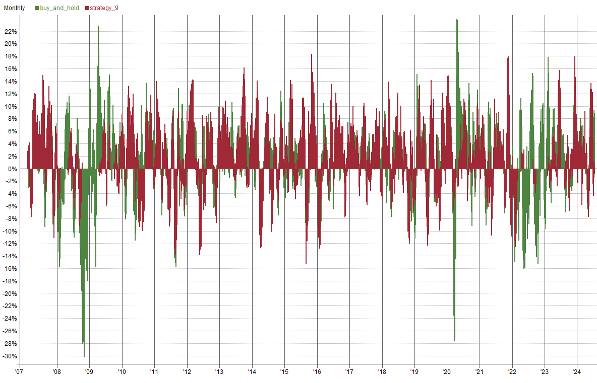
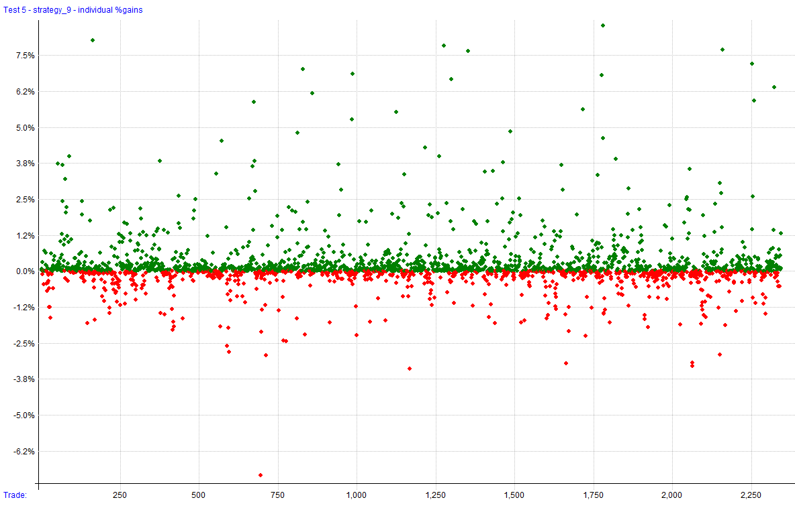
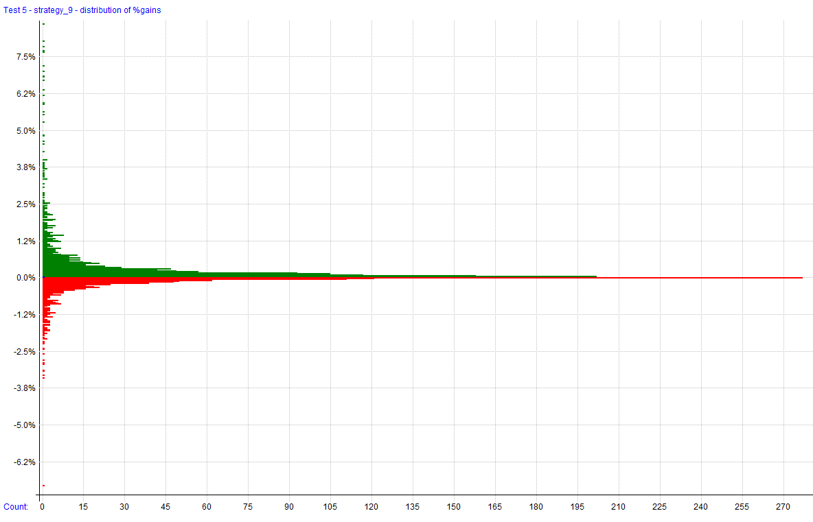
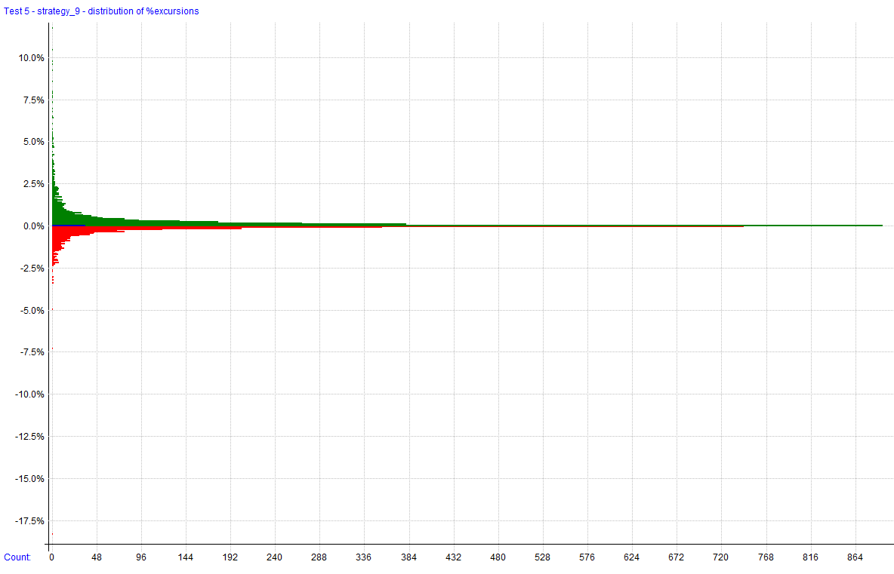
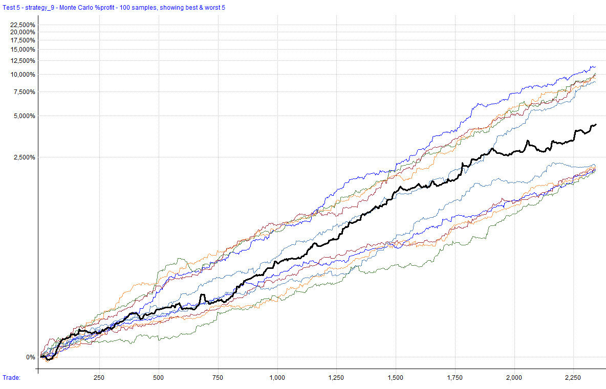
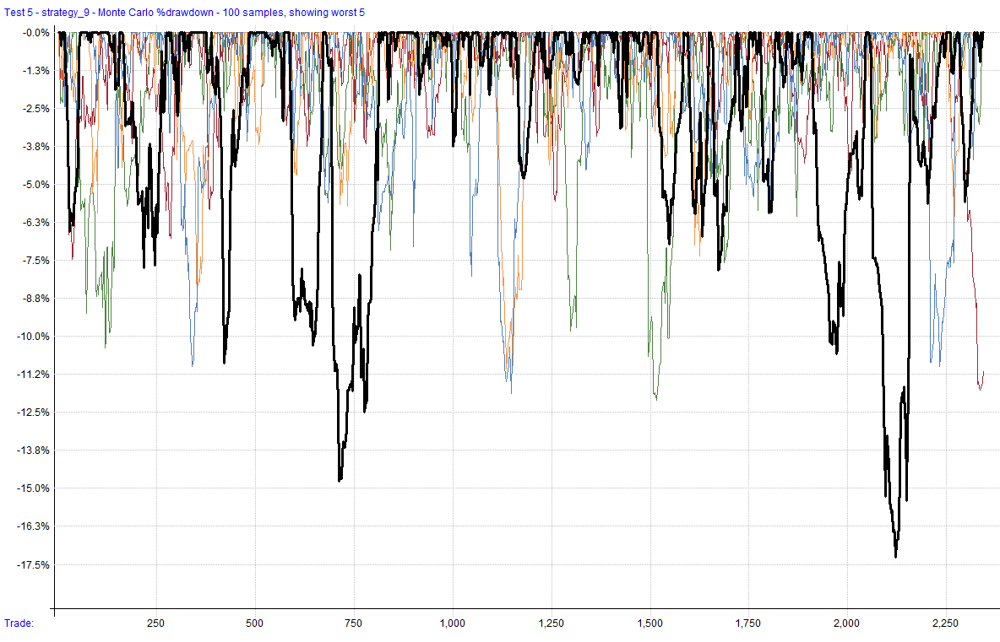

---
aliases:
  - Strategy 9 In Sample Test Results
tags:
  - strategy
  - report
title: Strategy 9
author: Larry Kann
---

# Strategy 9

This strategy utilizes dynamic sizing and a weekly rebalance to capture momentum in the Nasdaq 100, leveraging trend direction, market conditions, and liquidity filters to manage trades.

This file will be updated for as long as the strategy is being developed, deployed (live or simulation), or distributed. Once it has been discontinued, it will be noted here. The code block will always reflect the most recent version of the strategy. The change log can be used to see changes and adjustments to the code over time.

**Strategy Features**:

- Rotational Momentum Strategy (long only)
- Trades stocks on the Nasdaq 100
- Weekly rebalance
- Uses a regime filter and liquidity checks for protection against adverse market conditions
- Stocks ranked by relative strength
- Risk adjusted for volatility and tolerance level
- Max 5 positions

**Key Metrics**:
*Key metrics are from the latest backtest date in the date range above in the test settings.*

- Compound Annual Return: **22%**
- Max Historical Drawdown: **20%**
- Average Holding Period: **25 Days**
- Expectancy Per Trade: **5.49**%**
- Win Rate: **62%**
- Profit Factor: **2.03**
- Sharpe Ratio: **1.21**
- MAR Ratio: **1.10**

 **Data Source and Test Settings**:
*For transparency.*

- **Data Source**: Norgate
- **Universe**: Nasdaq 100 Constituents (current & past for testing) 
- **Benchmark**: QQQ
- **In-Sample Date Range**: 01/01/2007 to 07/12/2024
- **OS Date Range**: 07/12/2024 - Most recent Friday close
- **Bar Size**: Daily
- **Backtesting Platform/Engine**: RealTest

**Benchmark**:
*This strategy is used to make a comparison to the results of the custom strategy. It is a simple buy-and-hold strategy of QQQ and reinvests dividends.*

- **Benchmark Strategy**: Buy and hold QQQ.
- **Entry Setup**: Enter QQQ.
- **Exit Rule**: Reinvest dividends.

This strategy captures momentum opportunities in the Nasdaq 100 by utilizing dynamic sizing and rebalancing every week. It uses a relative strength (RS) factor and a linear regression (LR) slope to determine trend direction. The strategy uses a benchmark index fund for benchmark testing and to help calculate the regime filter. Position sizing is adjusted based on volatility and trade setups get ranked by certain strength factors.

Date range used for this backtest attempted to capture multiple bear markets and black swan events (2008, 2020) for testing robustness and safety/risk measures in the strategy.
## Settings

| Setting            | Value                                                |
| ------------------ | ---------------------------------------------------- |
| Bar Size           | Daily                                                |
| Account Size Start | $100,000                                             |
| Data Source        | Norgate                                              |
| Universe           | Nasdaq 100 Constituents (current & past for testing) |
| Benchmark          | QQQ                                                  |
| Date Range         | 01/01/2007 to 07/12/2024                             |
| Platform/Engine    | RealTest                                             |

## Summary Stats

|              | buy_and_hold* | strategy_9 |
| ------------ | ------------- | ---------- |
| Periods      | 4,411         | 4,411      |
| NetProfit    | $1,216,616    | $3,180,016 |
| Comp         | True          | True       |
| ROR          | 15.85%        | 22.04%     |
| MaxDD        | -53.40%       | -20.11%    |
| MAR          | 0.30          | 1.10       |
| Trades       | 75            | 2,344      |
| PctWins      | 77.33%        | 62.16%     |
| AvgWin       | 7.90%         | 12.61%     |
| AvgLoss      | 9.27%         | 6.21%      |
| WinLen       | 59.69         | 31.14      |
| LossLen      | 55.76         | 15.55      |
| Expectancy   | 4.01%         | 5.49%      |
| TradeLen     | 58.80         | 25.24      |
| ProfitFactor | 2.97          | 2.03       |
| Sharpe       | 0.77          | 1.21       |
| AvgExp       | 99.97%        | 69.97%     |
| MaxExp       | 100.67%       | 102.11%    |

*\*benchmark strategies are not included in combined stats*

## Combined Monthly Percent Gains

| YEAR    | Jan      | Feb      | Mar      | Apr      | May      | Jun      | Jul      | Aug      | Sep      | Oct      | Nov      | Dec      | **Total**  | MaxDD      |
| ------- | -------- | -------- | -------- | -------- | -------- | -------- | -------- | -------- | -------- | -------- | -------- | -------- | ---------- | ---------- |
| 2007    | 1.6%     | -2.1%    | 2.0%     | 8.2%     | 4.6%     | 4.7%     | 11.4%    | 4.2%     | 8.0%     | 3.3%     | -3.4%    | 0.2%     | **50.7%**  | -12.8%     |
| 2008    | -3.6%    | 0.0%     | 0.0%     | -1.0%    | 5.6%     | -3.7%    | 4.2%     | -5.6%    | -3.1%    | 0.0%     | 0.0%     | 0.0%     | **-7.4%**  | -11.9%     |
| 2009    | 0.0%     | 0.0%     | 0.0%     | 0.2%     | 5.0%     | 0.1%     | 1.9%     | 0.0%     | 0.8%     | -3.3%    | 3.7%     | 7.3%     | **16.3%**  | -6.1%      |
| 2010    | -2.2%    | 7.2%     | 7.5%     | 9.4%     | -0.4%    | -5.5%    | -2.0%    | -5.4%    | 7.2%     | 3.5%     | 1.6%     | 1.9%     | **23.6%**  | -17.0%     |
| 2011    | 8.8%     | 5.8%     | 2.5%     | 2.2%     | -4.8%    | -1.9%    | 1.0%     | -10.8%   | 0.9%     | 1.4%     | -1.3%    | 2.1%     | **4.5%**   | -20.1%     |
| 2012    | 5.4%     | 12.6%    | 1.6%     | 0.0%     | -9.4%    | -3.2%    | 3.6%     | 2.7%     | 3.8%     | -1.6%    | -0.3%    | 2.9%     | **18.0%**  | -16.9%     |
| 2013    | 4.9%     | 6.6%     | 6.7%     | 1.7%     | 0.9%     | 0.0%     | 3.8%     | 6.8%     | 14.3%    | -1.3%    | 1.9%     | 3.6%     | **62.0%**  | -5.5%      |
| 2014    | 6.9%     | 6.9%     | -9.7%    | -2.8%    | 6.0%     | 7.2%     | -8.3%    | 2.4%     | 2.3%     | 0.1%     | 4.4%     | -1.3%    | **12.9%**  | -16.0%     |
| 2015    | -1.5%    | 13.6%    | 1.4%     | -5.0%    | 3.9%     | 2.9%     | 9.4%     | -9.3%    | 0.5%     | 14.3%    | 5.5%     | 2.1%     | **41.3%**  | -17.0%     |
| 2016    | -10.3%   | -1.6%    | 6.7%     | -3.9%    | 11.0%    | 0.9%     | 8.1%     | 6.1%     | 6.7%     | -4.2%    | 2.4%     | 1.5%     | **23.4%**  | -12.4%     |
| 2017    | 8.0%     | 1.9%     | 3.5%     | -0.1%    | 7.2%     | -0.4%    | -0.2%    | 3.2%     | 1.9%     | 7.4%     | 1.5%     | -1.0%    | **37.6%**  | -8.4%      |
| 2018    | 8.1%     | 1.7%     | 0.8%     | 0.9%     | 2.9%     | 3.7%     | 2.3%     | 6.4%     | 0.1%     | -9.0%    | 1.4%     | -4.9%    | **14.0%**  | -12.6%     |
| 2019    | 6.2%     | 6.1%     | 3.2%     | -1.4%    | -9.7%    | 10.6%    | 5.3%     | -1.0%    | -7.5%    | 6.8%     | 1.4%     | 10.9%    | **32.8%**  | -15.0%     |
| 2020    | 4.5%     | -1.2%    | 0.9%     | -2.7%    | 6.0%     | 3.1%     | 4.5%     | 0.5%     | -0.1%    | -2.1%    | 9.0%     | 2.6%     | **27.0%**  | -9.4%      |
| 2021    | 5.0%     | 1.2%     | -3.4%    | -1.4%    | -0.5%    | 3.1%     | 4.1%     | 3.1%     | -2.1%    | 11.8%    | -1.4%    | -4.0%    | **15.3%**  | -14.6%     |
| 2022    | -10.0%   | 0.0%     | 0.0%     | 2.4%     | 0.0%     | 0.0%     | 0.0%     | -2.6%    | 0.0%     | 0.0%     | 0.0%     | 0.0%     | **-10.2%** | -13.1%     |
| 2023    | -0.7%    | -0.3%    | 5.3%     | 0.2%     | 12.0%    | 0.0%     | 0.0%     | 1.3%     | -3.9%    | -0.7%    | 18.0%    | -0.1%    | **33.5%**  | -7.4%      |
| 2024    | 1.8%     | 3.2%     | 1.6%     | -4.7%    | 10.2%    | -0.8%    | 2.4%     | n/a      | n/a      | n/a      | n/a      | n/a      | **13.7%**  | -9.3%      |
| **AVG** | **1.8%** | **3.4%** | **1.7%** | **0.1%** | **2.8%** | **1.2%** | **2.9%** | **0.1%** | **1.8%** | **1.5%** | **2.6%** | **1.4%** | **22.7%**  | **-12.5%** |

## Strategy Correlations

Returns:

|             | buy_and_hold | strategy_9 |
|-------------|--------------|------------|
| buy_and_hold| 1.00         | 0.53       |
| strategy_9  | 0.53         | 1.00       |

Drawdowns:

|              | buy_and_hold | strategy_9 |
| ------------ | ------------ | ---------- |
| buy_and_hold | 1.00         | 0.66       |
| strategy_9   | 0.66         | 1.00       |

### Daily Stats Graphs

### Trade Plots

## Monte Carlo Analysis

| Percentile | Net Profit  | CAR    | Max Drawdown |
|------------|-------------|--------|--------------|
| 1%         | 2,000.60%   | 19.00% | -15.08%      |
| 5%         | 2,439.11%   | 20.30% | -11.26%      |
| 10%        | 2,719.57%   | 21.02% | -9.90%       |
| 20%        | 3,208.37%   | 22.13% | -9.10%       |
| 50%        | 4,557.44%   | 24.54% | -7.09%       |
| 80%        | 6,718.60%   | 27.28% | -4.85%       |
| 90%        | 7,841.40%   | 28.39% | -4.00%       |
| 95%        | 9,308.48%   | 29.64% | -3.03%       |
| 99%        | 23,905.50%  | 36.77% | -2.53%       |
| backtest   | 3,180.02%   | 22.07% | -20.11%      |

